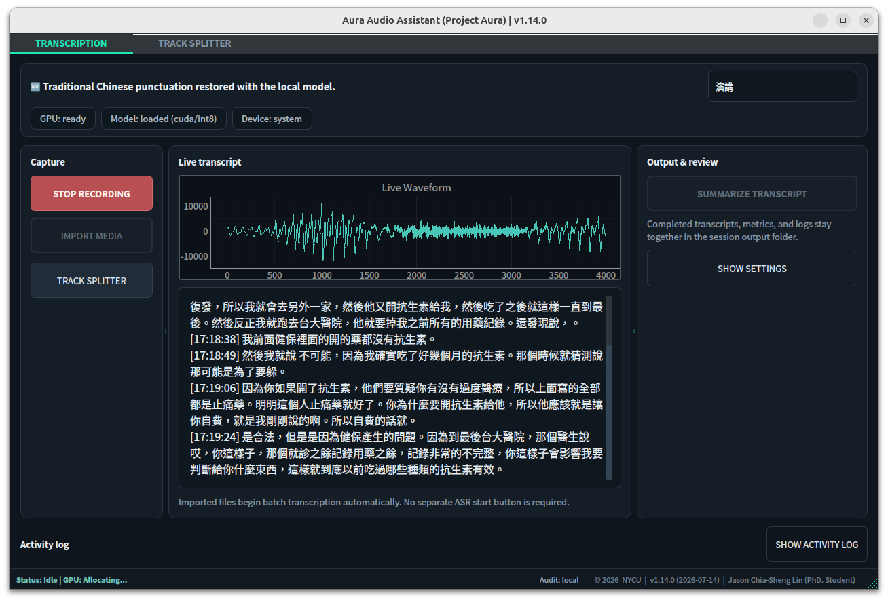
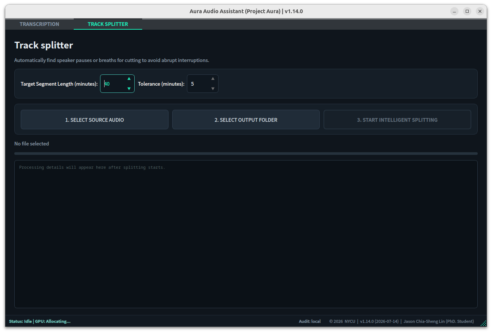

# Project AURA: Local Desktop Audio Assistant

<p>
  
  
  
  
  
  
</p>

*Repository indicators summarize maintenance, CI, runtime, ASR, UI, and license status.*

<!--
README FORMAT CONTRACT

Keep the rendered sections in this exact order:
1. Product Purpose
2. Project Status
3. Latest Update
4. Core Capabilities
5. Architecture and Ownership
6. Evidence-First Session Contract
7. Desktop Workflow
8. Installation
9. Configuration Defaults
10. Feature Behavior
11. Session Artifacts and Data Layout
12. Validation and Evidence
13. Development and Testing
14. Windows Runtime Path
15. Release and Versioning
16. Troubleshooting
17. Documentation Map
18. Repository Data Stewardship
19. License

Keep all rendered README copy in English. Place an explanatory caption
immediately after every screenshot, diagram, or illustration. Preserve
operational depth while routing dated history to GitHub Releases, design
detail to docs/, and measured runtime packets to artifacts/.

Preserve the Refactor Version, Latest Published Tag, Next Release Candidate
rows and the Latest Update heading because scripts/bump_version.py updates
them during release preparation.
-->

Project AURA is a local desktop audio assistant for professional meetings,
lectures, and review-intensive transcription workflows. It brings recording,
RTX/CUDA speech recognition, Traditional Chinese transcript preparation,
human review, local structured summaries, and evidence export into one
recoverable workflow.



*Figure 1. The transcription workspace keeps capture controls, CUDA readiness, waveform feedback, Traditional Chinese transcript review, output actions, and the local activity log in one operator view.*

## Product Purpose

AURA turns audio into a durable, reviewable meeting record. The application
keeps audio, transcript states, summary claims, and review events connected
through one session identity so operators can move from capture to confirmed
actions with a visible evidence path.

The active product flow is:

```text
Live capture or media import
        |
        v
Breeze ASR on RTX/CUDA
        |
        v
Traditional Chinese punctuation and glossary correction
        |
        v
Timestamped human review
        |
        v
Local Gemma 4 structured summary
        |
        v
Source-linked claims, exports, and evidence search
```

Use this repository for:

- the maintained PyQt6 desktop application;
- reusable audio, ASR, review, summary, diagnostics, and evidence services;
- regression tests and platform smoke checks;
- release packaging and semantic version automation;
- public runtime evidence with source manifests and measured event traces;
- architecture, product strategy, governance, and platform documentation.

## Project Status

| Field | Value |
| --- | --- |
| Project Name | Project AURA / Ultimate Audio Assistant |
| Refactor Version | `1.15.0` |
| Latest Published Tag | `v1.14.0` |
| Next Release Candidate | `v1.15.0` |
| Release State | `v1.15.0` source candidate is published on `main`; the annotated tag and GitHub Release form the next release gate |
| Primary Platform | Ubuntu 22.04 / 24.04 desktop |
| Python Runtime | Python 3.10+ |
| ASR Model | `SoybeanMilk/faster-whisper-Breeze-ASR-25` |
| ASR Runtime | NVIDIA RTX/CUDA with `int8` compute |
| Summary Runtime | Local Ollama `gemma4:e4b-it-qat` with reasoning enabled |
| Desktop UI | PyQt6 |
| Project Lead | Jason Chia-Sheng Lin, National Yang Ming Chiao Tung University |
| License | MIT |

### Release lineage

| Release | Contribution |
| --- | --- |
| `v1.15.0` candidate | Durable meeting sessions, crash recovery, timestamped transcript review, source-linked summary claims, and rebuildable local evidence search |
| `v1.14.0` | Operator-focused workspace, content-free local audit events, runtime diagnostics, integrity checks, and synchronized version automation |
| `v1.13.0` | Windows onboarding, portable packaging, RTX diagnostics, output policy, scheduling, and broader artifact visibility |
| `v1.12.0` | Structured transcript artifacts, progress telemetry, audio-quality controls, and modular transcription services |

GitHub Releases owns the durable release chronology. The sections below
describe the current product contract and link each capability to its
canonical design or evidence source.

## Latest Update — v1.15.0 (2026-07-23)

Project AURA v1.15.0 establishes an evidence-first local meeting workflow.
Each recording or import creates one canonical session that connects audio,
transcript revisions, structured summary claims, and human review.

### Durable meeting sessions

- Multi-source capture writes mixed, system, and microphone PCM journals as
  sources become available.
- Capture journals flush every second and reach an `fsync` checkpoint every
  five seconds.
- Atomic `session.json` updates preserve meeting identity, runtime state,
  artifact locators, and recovery guidance.
- Startup discovery presents recoverable sessions to the operator.
- Recovery reconstructs review-ready WAV evidence from the durable PCM
  journal and records the recovery acknowledgement.
- Recording and media import share the same transcript preparation and
  evidence model.

### Reviewable transcript and claims

- Live ASR provides provisional feedback while durable audio remains the source
  for the final timestamped pass.
- Transcript segments progress through `provisional`, `final`, and `confirmed`
  states.
- Operators can edit text, rename speakers across the meeting, navigate review
  signals, and open the matching audio span.
- Transcript edits append review events and activate summary invalidation
  before the revised canonical transcript is saved.
- Decisions and action items retain stable claim identity, source segment IDs,
  support status, and review status.
- Confirmed actions emerge from current source evidence and human review.

### Local structured summary runtime

- Summary generation receives the prepared corrected transcript from the
  current session.
- Nine field extractors run as one parallel application batch:
  `meeting_topic`, `participants`, `executive_summary`, `key_points`,
  `decisions`, `action_items`, `open_questions`, `risks`, and `next_steps`.
- Each field uses a dedicated prompt, an explicit JSON shape, Python
  validation, and one format-repair path.
- Python merges the validated fields and renders deterministic Markdown.
- The supported runner is local Ollama `gemma4:e4b-it-qat` through
  `/api/chat`, with `think=true`, `format=json`, `num_ctx=32768`,
  `num_predict=1536`, and `temperature=0`.
- Reasoning remains ephemeral runtime data; validated final content becomes the
  summary artifact.
- The local server starts with loopback binding, cloud access inactive, one
  server-side parallel sequence, Flash Attention, and q8 KV cache.

### Release validation

The v1.15.0 runtime correction passes `398` regression tests. The live local
LLM packet records 12 real model calls, including one complete nine-field
product pipeline. All nine final fields passed schema validation while AURA
ASR remained resident on the same 16 GB GPU.

The next validation layer uses a paired reviewed meeting corpus to measure
summary quality, source support, human correction time, queue time, and peak
VRAM. The complete product direction and activation gates live in
[`docs/aura-llm-agent-product-strategy.md`](docs/aura-llm-agent-product-strategy.md).

## Core Capabilities

| Capability | Current operating scope |
| --- | --- |
| Live recording | Captures system audio, microphone audio, or a balanced mixed stream through PulseAudio/PipeWire sources |
| Durable capture | Writes append-only PCM journals and atomic session state for recovery and final audio reconstruction |
| Scheduled recording | Arms a wall-clock start time and an optional wall-clock stop time through the standard recording path |
| Media import | Processes common FFmpeg audio and video containers through a visible, cancellable queue |
| GPU-only ASR | Runs Breeze ASR 25 through `faster-whisper` on the activated RTX/CUDA runtime |
| Traditional Chinese punctuation | Applies local model-backed punctuation when activated and deterministic full-width cleanup as the always-available preparation layer |
| Domain glossary correction | Uses conservative RapidFuzz thresholds and records each accepted correction |
| Transcript review | Supports timestamped edits, speaker renaming, review signals, audio-span playback, and revision-aware confirmation |
| Speaker diarization | Adds optional imported-file speaker labels through `pyannote.audio` |
| Local summary | Extracts nine structured meeting fields with local Gemma 4 and renders stable JSON and Markdown |
| Claim review | Connects decisions and actions to source segments, support status, review status, and append-only review events |
| Evidence search | Rebuilds a local SQLite FTS5 index for meetings, segments, and confirmed actions |
| Audio preparation | Provides FFmpeg normalization, bounded denoise presets, level protection, and progress telemetry |
| Meeting-distance modes | Offers `off`, `normal`, `far-speaker`, and `rescue-offline` policies with explicit activation paths |
| Track Splitter | Finds natural pause points around a target duration and exports ordered media chunks |
| Runtime Diagnostics | Reports GPU, CUDA, ASR model, FFmpeg, audio device, disk capacity, and output-path readiness |
| First Launch Check | Presents readiness gates and direct setup actions in the desktop UI |
| Local audit trail | Records content-free app and workflow events with redaction, retention, owner permissions, and hash-chain integrity |
| Windows onboarding | Provides check/start wrappers, diagnostic reports, hosted CI, RTX smoke scripts, and portable release packaging |

## Architecture and Ownership

The codebase keeps testable product logic outside Qt widgets and gives each
runtime concern one clear owner.

```text
project_aura/
├── pyproject.toml                  # package and dependency contract
├── Makefile                       # setup, check, build, and version commands
├── Start-AURA.* / Check-AURA.*    # Windows onboarding entry points
├── config/
│   └── domain_glossary.yaml        # conservative ASR correction terms
├── src/
│   ├── aura/
│   │   ├── asr/                    # transcription and punctuation services
│   │   ├── audio/                  # capture, denoise, export, and splitting
│   │   ├── diarization/            # optional speaker labeling
│   │   ├── llm/                    # local summary runtime integration
│   │   ├── system/                 # CUDA, paths, diagnostics, and updates
│   │   ├── ui/                     # PyQt6 widgets and interaction wiring
│   │   ├── audit.py                # content-free local audit events
│   │   ├── evidence_search.py      # rebuildable SQLite FTS5 index
│   │   ├── review.py               # transcript review and revision state
│   │   └── scheduling.py           # wall-clock scheduling rules
│   ├── asr_postprocess/            # glossary correction package
│   └── summary/                    # schemas, prompts, validation, rendering
├── scripts/                        # diagnostics, evaluation, and release tools
├── tests/                          # standard-library regression suite
├── docs/                           # design, setup, strategy, and roadmaps
├── artifacts/                      # measured public runtime evidence
└── img/                            # semantic product screenshots
```

### Module ownership

- `src/aura/settings.py` owns inspectable runtime defaults.
- `src/aura/asr/` owns file and live transcription behavior.
- `src/aura/audio/` owns source discovery, capture, mixing, denoise, export,
  recording durability, and media splitting.
- `src/aura/diarization/` owns speaker-model activation and timestamp overlap
  assignment.
- `src/aura/llm/` and `src/summary/` own local summary runtime, field schemas,
  validation, and deterministic rendering.
- `src/aura/review.py` owns transcript states, revisions, review events, and
  summary invalidation.
- `src/aura/evidence_search.py` owns rebuildable cross-meeting retrieval.
- `src/aura/system/` owns platform facts and readiness checks shared by the UI
  and command-line diagnostics.
- `src/aura/ui/` owns presentation, signals, and operator interaction.

The architecture rule is simple: behavior that can be verified independently
from Qt belongs in a service module with a focused regression check.

## Evidence-First Session Contract

### One meeting identity

Every recording or import receives one `meeting_id`. The corresponding
`session.json` acts as the artifact locator for audio, transcript segments,
summary claims, review events, and exported files. Each downstream stage reuses
the same identity.

### Durable audio source

The capture loop appends PCM frames to `.capture/` journals for the mixed
stream and each active source. Final WAV files are reconstructed from these
journals. Delivery formats such as M4A and MP3 are produced from the preserved
audio source, while the mixed WAV anchors transcript review and timestamp
playback.

### Transcript states and revisions

Live recognition supports operator awareness through provisional text. The
durable audio pass creates final timestamped segments. Human edits and
confirmation create revision-aware review events. Confidence, speaker
assignment, and overlap signals help operators prioritize attention.

### Source-linked summary claims

The structured summary records decisions and action items as claims with source
segment IDs. Each claim carries support and review state. Transcript revisions
activate a fresh summary evidence identity so confirmation always maps to the
current source.

### Rebuildable local retrieval

Canonical session artifacts remain the source of truth. `aura-evidence rebuild`
creates an atomic SQLite FTS5 derivative for fast local search. Query commands
open the index in read-only mode, and index replacement begins after schema and
version validation.

The current tool surface focuses on review and retrieval:

- meeting search;
- segment search;
- audio-span lookup;
- confirmed action retrieval.

External action connectors form a separately activated work package after a
real consumer, repeated operational demand, item-level approval, and audit
evidence establish the value.

## Desktop Workflow

### Transcription workspace

1. Open **Settings** and select the capture source, output policy, meeting
   distance mode, denoise profile, speaker labeling, and summary options.
2. Run **First Launch Check** to confirm GPU, CUDA, FFmpeg, audio devices,
   output capacity, ASR model, and local summary readiness.
3. Complete the meeting notice and consent confirmation.
4. Select **Start Recording** for live capture or **Import Media** for file
   transcription.
5. Follow waveform, status, transcript, progress, and activity feedback in the
   primary workspace.
6. Review timestamped segments, correct text, rename speakers, and open source
   audio spans.
7. Select **Summarize Transcript** or activate the post-ASR summary option.
8. Review source-linked decisions and actions, then export the required
   transcript and evidence formats.
9. Select **Open Output Folder** to inspect the complete session package.

### Settings and Runtime Diagnostics


*Figure 2. The Settings panel groups audio preparation, capture policy, scheduling, local summary, output location, model controls, and Runtime Diagnostics so operators can activate each capability from one workspace.*

Runtime Diagnostics reports:

- GPU identity and CUDA runtime readiness;
- ASR model load state and compute type;
- FFmpeg availability;
- input and output audio devices;
- selected output path and available disk capacity;
- local Ollama command, server, and model-tag readiness;
- speaker-diarization token readiness when that feature is selected.

The First Launch Check pairs each activation gate with focused setup guidance,
report copy, setup-folder access, and retry actions.

### Track Splitter



*Figure 3. Track Splitter presents the complete source-to-output sequence and keeps duration targets, tolerance, progress, and processing details visible during long media jobs.*

The Track Splitter workflow:

1. Select an audio or video source.
2. Select the output directory.
3. Set the target segment length and tolerance.
4. Start processing.
5. Review ordered chunks created near natural pauses.

## Installation

### Recommended Linux runtime

- Ubuntu 22.04 or 24.04 desktop
- Python 3.10 or newer
- NVIDIA RTX GPU with an activated CUDA runtime
- PulseAudio or PipeWire with PulseAudio compatibility
- FFmpeg, PortAudio development headers, and Python development headers
- `uv` for the repository Make targets

Install system packages:

```bash
sudo apt-get update
sudo apt-get install -y ffmpeg portaudio19-dev python3-dev
```

### Standard application environment

The standard profile includes the application and the model-backed
Traditional Chinese punctuation path:

```bash
make setup-app
uv run aura
```

`pyproject.toml` and `uv.lock` form the dependency contract for local setup,
CI, and release builds.

### Pip environment

```bash
python3 -m venv .venv
source .venv/bin/activate
python -m pip install --upgrade pip
python -m pip install -e ".[punctuation]"
aura
```

The package exposes three entry points:

- `aura`
- `project-aura`
- `aura-evidence`

### Complete development environment

```bash
make setup-dev
```

This profile installs every declared optional dependency group for development,
testing, evaluation, diarization, punctuation, and model research.

### Local meeting summary

Install Ollama, activate the local service, and pull the supported model:

```bash
ollama pull gemma4:e4b-it-qat
```

AURA verifies `http://localhost:11434/api/tags`, starts the local service when
the command is available, checks the exact model tag, and presents model-pull
actions through the desktop UI.

### Speaker diarization

```bash
python -m pip install -e ".[diarization]"
export HUGGINGFACE_TOKEN=hf_your_token_here
```

Accept the Hugging Face terms for
`pyannote/speaker-diarization-community-1`, then provide
`HUGGINGFACE_TOKEN`, `HF_TOKEN`, or an `AURA_HF_TOKEN_FILE` path through the
local secret environment.

## Configuration Defaults

| Setting | Default |
| --- | --- |
| Sample rate | `16000 Hz` |
| Audio frame | `30 ms` / `480 samples` |
| WebRTC VAD level | `3` |
| ASR model | `SoybeanMilk/faster-whisper-Breeze-ASR-25` |
| ASR device | `cuda` |
| ASR compute type | `int8` |
| ASR beam size | `5` |
| Language | `zh` |
| Target volume | `-20 dBFS` |
| Live capture source | System audio and microphone |
| Live maximum segment | `16.0 seconds` |
| Live energy gate | `1000.0 RMS` |
| Recording delivery format | `M4A / AAC-LC 96k` |
| Meeting distance mode | `off` |
| Denoise preset | `off` |
| Speaker diarization | Operator-activated; imported media; `2-6` speakers |
| Traditional Chinese punctuation | Active |
| Local summary | Operator-activated |
| Splitter target | `40 minutes` |
| Splitter tolerance | `5 minutes` |

### Runtime environment variables

| Variable | Purpose |
| --- | --- |
| `AURA_RUNTIME_DIR` | Location for transient normalized WAV files and live transcript backup |
| `AURA_AUDIT_DIR` | Local audit-event directory |
| `AURA_AUDIT_ENABLED` | Audit-event activation control |
| `AURA_AUDIT_RETENTION_DAYS` | Local audit retention period; default `90` days |
| `HUGGINGFACE_TOKEN` / `HF_TOKEN` | Speaker-diarization model access |
| `AURA_HF_TOKEN_FILE` | Local file path that supplies the diarization token |
| `AURA_CLEARVOICE_PYTHON` | Python runtime for the separately activated ClearVoice evaluation path |

The default transient runtime directory is:

```text
/tmp/project_aura/
```

Set a dedicated path when the runtime needs a different temporary storage
location:

```bash
export AURA_RUNTIME_DIR=/path/to/runtime
```

## Feature Behavior

### GPU-only ASR

AURA ASR runs on the CUDA execution contract. The settings layer, model loader,
file pipeline, live queue, runtime report, and smoke scripts share the same
device requirement. Runtime activation stops at a clear product-facing gate
when CUDA libraries or the ASR model require attention.

The file-transcription prompt guides the recognizer toward a professional
Traditional Chinese meeting record with full-width punctuation that follows
the speaker's tone. The Settings panel provides an editable prompt for each
workflow.

### Live capture and audio preservation

- Capture source choices include system audio, microphone, and a mixed stream.
- PulseAudio/PipeWire discovery resolves the default sink monitor and
  microphone source.
- Active-source RMS balancing applies bounded gain and mix headroom.
- The live queue records segment duration, ASR elapsed time, real-time factor,
  queue size, and backlog.
- The inactivity safeguard closes a live recording after 20 continuous minutes
  of speech inactivity and trims the trailing inactive frames.
- Recorded delivery audio uses M4A/AAC by default, with MP3 as an available
  compatibility format.

### Traditional Chinese punctuation and glossary correction

The punctuation layer recognizes Traditional Chinese transcript content and
applies readable full-width punctuation. The model-backed path uses
`p208p2002/zh-wiki-punctuation-restore`. The deterministic preparation path
normalizes punctuation width, spacing, duplicates, and sentence endings.

Glossary correction runs after ASR and before summary generation. RapidFuzz
matches terms against `config/domain_glossary.yaml` with category-specific
confidence thresholds. Each accepted change appears in the correction log,
while raw ASR text remains available for comparison.

### Speaker diarization

Speaker diarization is an imported-media capability. The pipeline:

1. prepares the source audio;
2. runs Breeze ASR;
3. runs `pyannote/speaker-diarization-community-1`;
4. maps each transcript segment to the speaker turn with the greatest timestamp
   overlap;
5. emits labels such as `SPEAKER_00` and `SPEAKER_01`;
6. presents speaker labels for operator review and meeting-wide renaming.

Equal minimum and maximum speaker counts activate an exact speaker count.
Different values activate the configured speaker range.

### Local structured summary

The summary pipeline receives the corrected transcript associated with the
current session. Its source of truth is structured JSON. Deterministic Markdown
rendering creates stable meeting notes for review, GitHub, Notion, Google Docs,
and email handoff.

The direct script path supports repeatable summary generation:

```bash
PYTHONPATH=src uv run python scripts/generate_meeting_summary.py \
  --transcript path/to/meeting_corrected.txt \
  --output-md reports/meeting_summary.md \
  --output-json reports/meeting_summary.json
```

The validated generation contract is:

| Parameter | Value |
| --- | --- |
| Base model | `google/gemma-4-E4B-it` |
| Ollama model tag | `gemma4:e4b-it-qat` |
| Endpoint | Local `/api/chat` |
| Reasoning | `think=true` |
| Context window | `32768` |
| Generation budget | `1536` |
| Temperature | `0` |
| Server parallelism | `1` |

vLLM is the next throughput candidate. Its implementation gate opens when
paired measurements demonstrate sustained concurrent demand or an agreed
queue-time, latency, throughput, or VRAM advantage.

### Denoise and meeting-distance modes

The desktop UI offers four meeting-distance policies:

- `off`: direct capture and preparation;
- `normal`: lightweight meeting-room preparation;
- `far-speaker`: stronger VAD bridging, bounded segment gain, and the medium
  preparation floor;
- `rescue-offline`: an imported-media evaluation path for ClearVoice or
  ClearerVoice.

The built-in denoise presets are `off`, `light`, and `medium`. Short buffers use
adaptive FFT and hop sizes. Silent buffers remain intact. DeepFilterNet3 and
ClearVoice stay in separate environments so the primary NumPy 2 application
contract remains stable.

Promotion of a new default begins with a fixed, reference-backed far-field
corpus and measured transcript quality. See
[`docs/denoise_upgrade_plan.md`](docs/denoise_upgrade_plan.md).

### Runtime diagnostics and local audit

The runtime report centralizes platform facts for command-line tools, ASR
activation guidance, and the desktop UI. The local audit system records
content-free lifecycle, UI, model, recording, import, summary, splitter, and
diagnostic events.

Audit stewardship includes:

- transcript, summary, audio, prompt, credential, and path redaction;
- stable lowercase event identifiers;
- per-session sequence numbers;
- SHA-256 hash-chain integrity;
- owner-focused local permissions;
- configurable retention;
- Markdown and JSON analysis reports;
- workflow completion, latency, repeated-action, and anomaly review signals.

Canonical design:
[`docs/audit-event-system-design.md`](docs/audit-event-system-design.md).

### Track Splitter

Track Splitter decodes the source through FFmpeg/pydub, locates silence near
the configured target duration, exports ordered chunks, and reports progress.
MP3 exports reuse the source bitrate when the media metadata provides it.

## Session Artifacts and Data Layout

### Output location policy

Settings provides three output policies:

- **Same folder as source/recording** keeps artifacts beside the selected
  source or recording package.
- **Project outputs/transcripts folder** stores artifacts under
  `outputs/transcripts/`.
- **Custom folder** sends session artifacts to an operator-selected location.

### Canonical session package

A completed workflow can contain a canonical session directory:

```text
{base}_session/
├── session.json
├── .capture/
│   ├── mixed.pcm
│   ├── system.pcm
│   └── microphone.pcm
├── {recording}.wav
├── {recording}_system.wav
├── {recording}_microphone.wav
├── prepared_transcript.json
├── segments.json
├── summary.json
└── review_events.jsonl
```

Operator-facing transcript and telemetry artifacts remain beside the session
directory under the selected output policy:

```text
{base}_raw.txt
{base}_corrected.txt
{base}_summary.txt
{base}_final.txt
{base}_correction_log.json
{base}_processing_metrics.json
{base}_event_log.json
{base}_runtime.log
review exports in JSON, Markdown, SRT, or VTT
```

The exact set reflects the selected capture sources and activated processing
features. `session.json` records the authoritative artifact locators.

### Evidence search commands

```bash
aura-evidence rebuild outputs/transcripts outputs/aura-evidence.sqlite3
aura-evidence search-meetings outputs/aura-evidence.sqlite3 "acceptance"
aura-evidence search-segments outputs/aura-evidence.sqlite3 "organization name"
aura-evidence confirmed-actions outputs/aura-evidence.sqlite3
```

The rebuild command writes an atomic derivative from canonical session
artifacts. Meeting, segment, and confirmed-action queries use read-only index
connections.

## Validation and Evidence

### Current evidence summary

| Evidence layer | Result |
| --- | --- |
| Regression suite | `398` tests pass for the v1.15.0 runtime correction |
| AURA ASR live minimum | 10 real CUDA/int8 transcriptions over five public Common Voice 24 zh-TW clips |
| Paired ASR runtime | AURA Breeze ASR 25 and Meetily Breeze ASR 26 each classify as `valid_target_runtime` |
| Local LLM live minimum | 12 real calls, including one complete nine-field product pipeline |
| LLM schema validity | 9 of 9 final product fields pass schema validation |
| CI | Ubuntu compile/unit checks and Windows hosted smoke and packaging checks |

### GPU-only ASR packet

[`artifacts/asr-benchmark/2026-07-13-common-voice24-minimum/`](artifacts/asr-benchmark/2026-07-13-common-voice24-minimum/)
contains:

- five public Common Voice 24 zh-TW clips with reference text;
- 20 real transcriptions across the paired AURA and Meetily paths;
- request summaries and run configuration;
- event traces and error logs;
- GPU telemetry;
- latency analysis;
- runtime validity classification;
- source manifest and final decision report.

The clean-speech minimum validates the paired GPU execution contract.
Long-form, far-field, overlapping, and noisy meeting speech form the next
comparison layer.

Audit event:
[`docs/audit-events/2026-07-14-gpu-only-asr-live-benchmark/audit-event.md`](docs/audit-events/2026-07-14-gpu-only-asr-live-benchmark/audit-event.md).

### Local Gemma 4 packet

[`artifacts/llm-runtime/2026-07-23-ollama-gemma4-e4b-qat-minimum/`](artifacts/llm-runtime/2026-07-23-ollama-gemma4-e4b-qat-minimum/)
contains:

- the exact Ollama and model configuration;
- 12 real model requests;
- a complete nine-field AURA summary run;
- request summaries and event traces;
- GPU telemetry with AURA ASR resident;
- schema and runtime validity reports;
- latency, analysis, source manifest, and final product decision.

This packet validates local execution, reasoning/content separation,
structured completion, and shared-GPU operation. The paired reviewed corpus
adds product-quality and human-effort evidence.

## Development and Testing

### Run the complete check

```bash
make check
```

This command compiles source and tests, then runs the standard-library
regression suite.

Equivalent commands:

```bash
PYTHONPATH=src python -m unittest discover -s tests
python -m compileall src tests
```

### Focused release checks

```bash
PYTHONPATH=src python -m unittest -q \
  tests.test_versioning \
  tests.test_bump_version
```

### Coverage areas

The regression suite covers:

- file import preparation, formatting, cleanup, queueing, and cancellation;
- durable recording journals, checkpoints, recovery, and partial audio
  preservation;
- session identity, transcript revisions, review events, and stale-summary
  invalidation;
- source-linked decisions, actions, claim review, and confirmed-action search;
- SQLite schema validation, atomic rebuild, read-only queries, and path
  containment;
- CUDA activation, model loading, runtime diagnostics, and report formatting;
- live capture source discovery, RMS mixing, VAD, inactivity safeguards, and
  telemetry;
- M4A and MP3 export, normalization, limiter behavior, and FFmpeg progress;
- punctuation, glossary correction, correction logs, and artifact naming;
- speaker diarization timestamps and speaker-count policy;
- local Gemma prompts, schemas, reasoning contract, output validation, and UI
  runtime integration;
- denoise presets, meeting-distance modes, and evaluation gates;
- scheduled recording calculations;
- Track Splitter selection, ordering, export, and progress;
- audit redaction, integrity, retention, reporting, and workflow analysis;
- Windows-hosted setup, packaging layout, and RTX smoke contracts.

### Build artifacts

```bash
make build
```

The build uses `uv build` to produce a source distribution and wheel from the
package metadata.

## Windows Runtime Path

### Portable onboarding

1. Install or update the NVIDIA driver.
2. Extract `aura-windows-portable-v<version>.zip`.
3. Run `Check-AURA.bat`.
4. Review `diagnostic_report.txt`.
5. Run `Start-AURA.bat`.

The wrappers prepare `.venv`, install dependencies, verify FFmpeg and NVIDIA
visibility, run the shared RTX/CUDA diagnostics, and launch the same PyQt6
application used by Linux.

### Developer validation

```powershell
nvidia-smi
python scripts/runtime_report.py
python scripts/windows_gpu_smoke.py
python scripts/windows_asr_artifact_smoke.py
```

The Windows path includes:

- hosted GitHub Actions for compile, unit, PyQt import, runtime report, and
  portable packaging;
- a gated self-hosted RTX lane for real model-load and ASR artifact smoke;
- root-level PowerShell and batch entry points;
- a versioned portable ZIP builder;
- platform-specific setup and activation guidance.

Detailed guides:

- [`docs/windows_setup.md`](docs/windows_setup.md)
- [`docs/windows_native_roadmap.md`](docs/windows_native_roadmap.md)
- [`docs/windows_known_issues.md`](docs/windows_known_issues.md)

## Release and Versioning

Project AURA uses semantic versioning. Package versions use
`MAJOR.MINOR.PATCH`; Git tags and GitHub Releases use `vMAJOR.MINOR.PATCH`.

Prepare a version:

```bash
make bump-version BUMP=patch RELEASE_DATE=YYYY-MM-DD
make check
make build
```

The version helper synchronizes:

- `pyproject.toml`;
- `src/aura/metadata.py`;
- `uv.lock`;
- the README `Refactor Version` row;
- the README `Next Release Candidate` row;
- the README `Latest Update` heading.

`Latest Published Tag` records the release tag that currently exists. The
candidate row records the package version preparing for its next annotated tag
and GitHub Release.

The complete release contract is documented in
[`docs/versioning.md`](docs/versioning.md).

## Troubleshooting

### GPU memory pressure

- Keep ASR compute type at `int8`.
- Close other GPU-intensive applications before long recordings.
- Use Runtime Diagnostics to review device state and model readiness.
- AURA releases model references and clears available CUDA cache during
  lifecycle cleanup.

### CUDA activation

- Run `nvidia-smi`.
- Run `python scripts/runtime_report.py`.
- Confirm CUDA, cuBLAS, cuDNN, `ctranslate2`, and `faster-whisper` readiness.
- Refresh the environment with `uv sync` after dependency updates.

### Audio source discovery

- Confirm microphone and output devices in system settings.
- Confirm the PulseAudio/PipeWire compatibility service.
- Inspect sources with:

```bash
pactl info
pactl list short sources
```

- Runtime status and event logs record the selected source and active capture
  path.

### Local summary activation

- Confirm `ollama` is available on `PATH`.
- Confirm the loopback service at `http://localhost:11434`.
- Confirm the exact model tag:

```bash
ollama list
ollama pull gemma4:e4b-it-qat
```

- Retry First Launch Check after the service and model become ready.

### Speaker diarization activation

- Install the `diarization` extra.
- Accept the model terms for
  `pyannote/speaker-diarization-community-1`.
- Provide `HUGGINGFACE_TOKEN`, `HF_TOKEN`, or `AURA_HF_TOKEN_FILE`.
- Run Runtime Diagnostics to confirm token and model readiness.

### Long media and output size

- Keep FFmpeg visible on `PATH`.
- Select an output location with at least 1 GiB of available capacity.
- Use Track Splitter for delivery-sized media chunks.
- Review processing metrics for normalization stages, elapsed time, and export
  paths.

## Documentation Map

| Document | Purpose |
| --- | --- |
| [`docs/architecture_decisions.md`](docs/architecture_decisions.md) | Module ownership, GPU execution, session identity, evidence, output, and platform decisions |
| [`docs/aura-llm-agent-product-strategy.md`](docs/aura-llm-agent-product-strategy.md) | Product positioning, public pain evidence, local summary strategy, and Agent activation gates |
| [`docs/audit-event-system-design.md`](docs/audit-event-system-design.md) | Audit schema, privacy, integrity, retention, analysis, and operator controls |
| [`docs/asr_postprocess_fuzzy_glossary.md`](docs/asr_postprocess_fuzzy_glossary.md) | Glossary correction thresholds, artifacts, and validation path |
| [`docs/denoise_upgrade_plan.md`](docs/denoise_upgrade_plan.md) | Far-field corpus, denoise candidates, evaluation metrics, and promotion gate |
| [`docs/first-principles-aura-meetily-review.md`](docs/first-principles-aura-meetily-review.md) | Cross-repository product ownership and capability migration evidence |
| [`docs/refactor_plan.md`](docs/refactor_plan.md) | Refactor phases, module boundaries, and acceptance checks |
| [`docs/versioning.md`](docs/versioning.md) | Semantic version synchronization, checks, builds, tags, and releases |
| [`docs/windows_setup.md`](docs/windows_setup.md) | Windows environment preparation and RTX validation |
| [`docs/windows_native_roadmap.md`](docs/windows_native_roadmap.md) | Windows runtime and portable release direction |
| [`docs/windows_known_issues.md`](docs/windows_known_issues.md) | Platform activation guidance and tracked validation layers |

## Repository Data Stewardship

- Application source, tests, small stable fixtures, documentation, and public
  evidence packets belong in version control.
- Private recordings and transcripts belong in the operator-selected output
  location, `outputs/`, or a dedicated data repository.
- `tests/fixtures/` carries small, stable samples that directly support
  regression checks.
- `artifacts/` carries public, source-described, reproducible runtime evidence.
- `.record/`, local virtual environments, build products, transient runtime
  files, and private operator data stay within their designated local storage.
- Audit events remain content-free and apply redaction, local permissions,
  retention, and integrity controls.
- Credentials remain in local environment or secret-store paths.

## License

Project AURA is available under the [MIT License](./LICENSE).

Copyright (c) 2026 Jason Chia-Sheng Lin.
