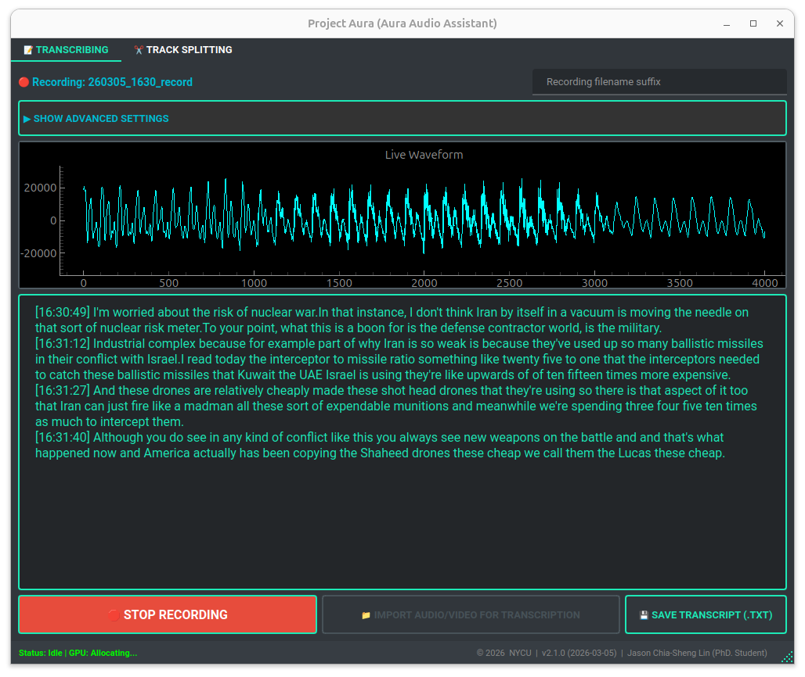
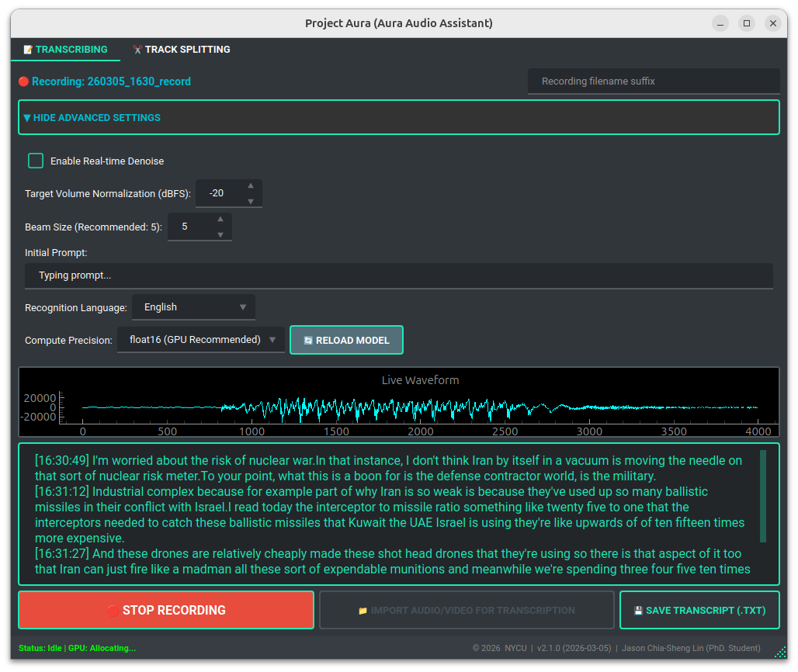

# Project AURA: Ultimate Audio Assistant Refactor

      

Project AURA is a desktop audio assistant for real-time recording, Whisper-based transcription, batch file transcription, and smart audio splitting.

This repository is the clean Python refactor of the working `audio_assistant_v1.5.0.py` script from `record_audio_ubuntu`. It intentionally does **not** copy the recording archive, `.record/` virtual environment, temporary transcripts, or generated media files.



## Project Status

The original `record_audio_ubuntu` folder mixed source code, runtime environment, and many generated recordings/transcripts. This sibling repository separates the maintainable application source from runtime data.

Use this repo for:

- source refactoring
- package structure
- tests and regression checks
- future Python releases

Keep historical recordings and generated transcripts in `record_audio_ubuntu` or another data folder.

The legacy one-file implementation is retained for audit and behavior comparison:

```text
docs/legacy_audio_assistant_v1.5.0.py
```

## Executive Summary

Project AURA integrates two core workflows:

1. **Real-time / file-based transcription** with timestamped logs.
2. **Smart audio splitting** that finds natural pause points to avoid cutting speech mid-sentence.

The app is designed for professional meeting and lecture workflows. It includes prompt-guided ASR, Traditional Chinese punctuation restoration, optional background noise reduction, batch processing, and memory-management safeguards for heavier ASR workloads.

## Project Metadata

| Field | Value |
| --- | --- |
| Project Name | Project AURA / Ultimate Audio Assistant |
| Refactor Version | `1.12.0` |
| Current Release Tag | `v1.12.0` |
| ASR Model | `SoybeanMilk/faster-whisper-Breeze-ASR-25` |
| GitHub Repository | `JasonLn0711/project_aura` |
| Academic Affiliation | National Yang Ming Chiao Tung University (NYCU) |
| Project Lead | Jason Chia-Sheng Lin (PhD. Student) |
| License | MIT |

## What We Updated Today (2026-05-29)

Project AURA has moved from an Ubuntu-focused refactor into a cross-platform RTX workstation foundation. The contribution in this update is practical: AURA now has a Windows native validation path, a shared runtime diagnostics layer, a workstation-oriented PyQt layout, Windows CI coverage, and a portable developer release path. The evidence is concrete: the local CUDA smoke check loaded the default `SoybeanMilk/faster-whisper-Breeze-ASR-25` model on `cuda/int8`, the ASR artifact smoke wrote raw/final/metrics transcript outputs, and both Ubuntu and Windows GitHub Actions completed successfully after the hosted Windows runner was given FFmpeg.

This release adds four durable capabilities:

1. **Windows native RTX validation**: `scripts/windows_gpu_smoke.py` checks `nvidia-smi`, Python imports, CUDA runtime visibility, cuBLAS/cuDNN, `ctranslate2`, and the required `WhisperModel(..., device="cuda", compute_type="int8")` load path.
2. **Copyable runtime diagnostics**: `scripts/runtime_report.py` and the new `src/aura/system/` diagnostics modules report OS, Python, GPU, CUDA, cuBLAS, cuDNN, `ctranslate2`, `faster-whisper`, FFmpeg, audio devices, and output-folder writability.
3. **Windows-friendly workstation UI**: the transcription workspace now exposes left-side workflow commands, top GPU/model/device status, a central transcript workspace, right-side artifact/export/summary/settings controls, and a bottom runtime log. Runtime Diagnostics can copy the diagnostic report, and error dialogs expose the same report.
4. **Windows CI and portable release path**: `.github/workflows/windows.yml` runs hosted Windows tests, PyQt import smoke, runtime-report smoke, and portable packaging smoke. A gated self-hosted Windows RTX job can run both the GPU model-load smoke and the ASR artifact smoke. `scripts/build_windows_portable.ps1` prepares `dist/aura-windows-portable/` with setup docs, runtime checkers, known issues, and a generated sample WAV.

The supported scope is clear: hosted Windows CI verifies source compatibility and non-GPU runtime reporting; self-hosted RTX validation is the gate for CUDA performance claims. Installer work remains a planned extension after the portable developer release has been exercised on real Windows RTX hardware.

## Previous Update (2026-05-25)

The real problem in meeting transcription is rarely that a person does not know how to press a button. The problem is that humans are busy, meetings start while we are still switching context, and recordings often keep running long after the real conversation has ended. A transcription tool should protect attention instead of demanding more of it.

Before today, AURA already had the essential professional workflow: live recording, real-time ASR, optional summary generation, automatic transcript artifact saving, and an output folder policy. But it still depended on one fragile human habit: remember exactly when to start, and remember exactly when to stop.

Today we added two safety rails:

1. **Scheduled live recording**: AURA can now arm a recording for a specific wall-clock `HH:mm` start time, with an optional `HH:mm` auto-stop time. If the selected time has already passed today, AURA rolls it to the next matching time. If the stop time is earlier than the start time, AURA treats it as a next-day stop.
2. **No-voice failsafe**: if live capture detects no human voice for 20 continuous minutes, AURA automatically stops the recording and trims the final no-voice audio from the saved WAV/MP3 path. This prevents forgotten recordings from turning into long silent files.

We compared four implementation paths before choosing this design:

- OS-level scheduling such as cron/systemd timers: powerful, but too detached from the desktop recording state and transcript artifact workflow.
- A UI-only countdown timer: simple, but it cannot know whether the room is still active or only silent.
- A fixed maximum recording duration: safe, but it can interrupt long lectures or research meetings at the worst moment.
- Capture-layer voice-aware stopping: slightly more work, but it uses the same live audio stream that drives ASR and can trim the saved audio at the exact place where useful speech ends.

The final decision is intentionally hybrid: wall-clock scheduling belongs in the PyQt interaction layer, while the 20-minute no-voice guard belongs in the audio capture layer. That keeps the feature predictable for the user and keeps the saved transcript/audio artifacts consistent with the same recording pipeline AURA already trusts.

## Current Working Version Changes

`v1.12.0` turns the refactor from an Ubuntu RTX meeting-transcription workstation into a cross-platform validation foundation. The main goals are: keep ASR on the required RTX/CUDA path, make Windows native feasibility testable, centralize platform/runtime diagnostics, expose copyable diagnostic reports in the UI, preserve transcript artifact guarantees, and give Windows CI/portable packaging a concrete first lane.

### User Workflow Changes

- The primary transcription tab now uses a workstation layout: left-side workflow actions, top GPU/model/device status, central waveform/transcript workspace, right-side artifact/export/summary/settings controls, and a bottom runtime log.
- Runtime Diagnostics can be refreshed from the UI and copied as a developer-ready report.
- Error dialogs for model loading, file transcription, and summary failures expose the same diagnostic report through details and a copy button.
- The main transcription controls are simplified around the actual user actions: **Start/Stop Recording**, **Import Media**, optional **Cancel Import**, optional **Open Output Folder**, and **Summarize Current Transcript**.
- Live recording can be armed from Advanced Settings to start at a selected wall-clock time. The same schedule can optionally auto-stop at a selected wall-clock time, including next-day stop times when the end time is earlier than the start time.
- Live recording now has a 20-minute no-voice failsafe: if AURA does not detect human voice for 20 continuous minutes, it auto-stops and trims the trailing no-voice audio before saving the recording.
- The previous standalone **Save Transcript** and **Clear Transcript** buttons are removed from the primary workflow.
- After **Stop Recording**, AURA now waits for the live ASR queue to finish, runs the optional LLM summary if enabled, saves transcript artifacts automatically, clears the visible transcript pane, and removes the temporary transcript backup.
- After an auto-save, **Open Output Folder** becomes available so the user can inspect the generated files without searching manually.
- Import wording is shortened to **Import Media** because the import action already starts transcription automatically.
- The transcript field is now treated as a working display, not the user's permanent storage layer. The permanent record is the artifact set saved under the selected output policy.

### Transcript Artifact Changes

Transcripts are now saved as a durable artifact set instead of one manually saved text file:

```text
{base}_raw.txt
{base}_final.txt
{base}_summary.txt
{base}_processing_metrics.json
```

- `raw.txt` contains the ASR transcript only.
- `final.txt` contains the transcript plus the LLM summary when a summary is available.
- `summary.txt` contains only the LLM summary and is written only when a summary is produced.
- `processing_metrics.json` records the workflow type, source path, output policy, output paths, total elapsed time, coarse stage durations, and imported-file status events.

This split makes it possible to compare the original ASR output with the final user-facing transcript and audit where the file was saved.

### Import And Batch Processing Changes

- Imported audio/video files are processed as a queue.
- When **Summarize transcript after ASR** is enabled, each imported file now completes ASR, summary, and artifact saving before the next queued file begins.
- This prevents later batch files from skipping summary when a previous summary is still running.
- **Cancel Import** now clears the remaining queue and requests cancellation of the active import worker.
- Supported import formats include common audio/video containers such as `mp3`, `mp4`, `m4a`, `wav`, `flac`, `mkv`, `mov`, `ogg`, `aac`, `wma`, `aiff`, `opus`, `webm`, `avi`, `m4v`, `3gp`, and `3g2`, with an **All Files** fallback for other FFmpeg-supported media.
- Each imported file records status events in metrics, including preparation, normalization, ASR, optional punctuation restoration, optional diarization, optional summary, and artifact save stages.

### Live Capture And Audio Quality Changes

- Live recording can now request **System audio + microphone**, **System audio only**, or **Microphone only** from Advanced Settings.
- On PulseAudio/PipeWire systems, AURA uses `pactl` to discover the default sink monitor and default microphone source, then uses `parec` readers for precise source capture.
- When PulseAudio/PipeWire source discovery is unavailable, the app reports the fallback and records from the default PyAudio/Pulse input instead of failing silently.
- System-audio plus microphone capture is mixed before VAD/ASR as 16 kHz mono `int16` frames.
- Mixed live capture now applies RMS-based active-source balancing. Silent/background-only chunks are ignored, active sources receive limited gain, and mix headroom is preserved so microphone speech and system audio do not clip or drown each other out.
- If no voice-like live audio is detected for 20 continuous minutes, the capture layer stops the recording and removes the final no-voice tail before the WAV is normalized/exported.
- The selected live capture mode is stored in recording metrics as `capture_source`.

### ASR, GPU, And Readability Changes

- ASR model loading is pinned to `cuda`. CPU fallback is intentionally disabled so transcription never silently leaves the RTX GPU path.
- CUDA runtime/cuBLAS/cuDNN availability is checked before loading the ASR model; missing runtime libraries produce a product-facing RTX/CUDA activation error with platform-specific guidance for Windows native, WSL, Linux native, and Docker.
- Windows native feasibility is covered by `scripts/windows_gpu_smoke.py`, which verifies `nvidia-smi`, Python imports, CUDA DLL/runtime visibility, cuBLAS/cuDNN, and the actual `WhisperModel(..., device="cuda", compute_type="int8")` model-load path.
- `scripts/runtime_report.py` produces a copyable report covering OS, Python, GPU, CUDA, cuBLAS, cuDNN, `ctranslate2`, `faster-whisper`, FFmpeg, audio I/O, and output-folder writability.
- File ASR keeps the Traditional Mandarin meeting-record prompt by default; live ASR keeps a separate live prompt default.
- Traditional Chinese transcript text now runs through post-ASR punctuation restoration. The model-backed path first tries `kotoba-speech/mmbert-base-zh-punctuation-320000`, then falls back to `p208p2002/zh-wiki-punctuation-restore`.
- If punctuation dependencies or model weights are unavailable, AURA uses deterministic full-width punctuation cleanup instead of blocking ASR or transcript saving.
- Punctuation restoration is conservative: it adds/normalizes punctuation for readability but does not translate Simplified Chinese, rewrite vocabulary, or replace the ASR text.

### Advanced Settings Changes

Advanced Settings now includes a transcript output policy:

- **Same folder as source/recording**: default; keeps imported transcripts beside the source file and live-recording transcripts in the recording folder.
- **Project outputs/transcripts folder**: writes transcript artifacts under `outputs/transcripts/` in this repo.
- **Custom folder**: writes all transcript artifacts to a user-selected folder.

Existing advanced options remain available: live capture source, denoise mode, speaker diarization, LLM summary, target volume normalization, beam size, initial prompt, language, compute precision, output policy, and model reload.

Runtime Diagnostics now appears alongside these controls. It reports GPU detection, CUDA runtime status, ASR model load status, audio input/output status, output-folder writability, and includes a **Copy Diagnostic Report** action.

Advanced Settings also includes scheduled live recording:

- **Schedule recording start** turns the main recording button into **Schedule Recording** and starts live recording/transcription at the selected `HH:mm` wall-clock time.
- **Auto-stop at** is optional. When enabled, AURA automatically stops the scheduled recording at the selected `HH:mm` wall-clock time and then uses the normal transcript finalization and artifact save workflow.
- If the selected start time has already passed for the day, AURA schedules the next matching wall-clock time. If the selected stop time is not after the scheduled start, AURA treats it as a next-day stop.

### Progress And Performance Visibility Changes

- Import normalization progress is surfaced in the status line, including CPU thread budget, FFmpeg volume-analysis pass, detected mean volume, gain amount, export progress percentage, and completion.
- Imported-file status events are retained in `processing_metrics.json`, so users can inspect what happened after the run finishes.
- FFmpeg normalization uses a multi-core CPU policy of `CPU count - 6` threads, with a minimum of `1`.
- CPU count detection tries multiple probes and reports clearly if CPU count cannot be detected.
- ASR remains RTX/CUDA-only. CPU fallback is disabled so transcription never silently leaves the GPU path.
- Traditional Chinese transcripts now run through post-ASR punctuation restoration. When the optional punctuation dependencies and model are available, AURA uses a local Chinese punctuation model; otherwise it falls back to safe full-width punctuation normalization and sentence-final punctuation.
- The app surfaces long-running import stages through the status line instead of leaving the user unsure whether normalization or ASR is still running.

### Dependency And Optional Model Changes

- Core ASR dependencies stay in the base install.
- Speaker diarization remains an optional `diarization` extra because it pulls in `pyannote.audio` and PyTorch.
- LLM summary remains an optional `summary` extra because it loads a local 9B model.
- Traditional Chinese punctuation model support is available through the optional `punctuation` extra. Without it, the built-in rule fallback still improves saved Traditional Chinese transcripts.

### Documentation And Test Changes

- `docs/windows_setup.md` documents the Windows native setup path, including Python 3.11 venv creation, optional extras, GPU smoke testing, and app launch.
- `docs/windows_known_issues.md` records the current Windows CUDA/audio/packaging boundaries.
- `.github/workflows/windows.yml` adds hosted Windows checks for unit tests, PyQt import smoke, runtime-report smoke, and portable packaging smoke; the gated self-hosted RTX lane runs CUDA model-load and ASR artifact smoke tests.
- `scripts/windows_asr_artifact_smoke.py` generates a tiny WAV, runs a CUDA/int8 ASR pass, and verifies raw/final/metrics transcript artifact output.
- README workflow documentation now matches the simplified UI and automatic transcript-saving behavior.
- `docs/architecture_decisions.md` records the first-principles ownership split for transcript artifacts, output policy, progress visibility, UI interaction policy, live capture ownership, and Traditional Chinese punctuation post-processing.
- Tests now cover transcript artifact naming, raw/final/summary splitting, metrics JSON writing, FFmpeg progress parsing, CPU-count detection, live capture source selection, RMS-based source mixing, scheduled wall-clock calculation, no-voice auto-stop/trailing-trim helpers, Traditional Chinese punctuation post-processing, runtime diagnostics reporting, and propagation of normalization progress into the import pipeline.

### Current Architecture Health

The project is still within a maintainable size for a desktop transcription tool, but three areas are now clear refactor candidates:

- `src/aura/ui/transcription_tab.py` should be split further because it still coordinates UI widgets, import queue state, recording session state, summary scheduling, metrics, and transcript saving.
- `src/aura/audio/capture.py` should eventually be split into PulseAudio/PipeWire source discovery, audio readers, source mixing, and recorder-thread orchestration.
- Windows audio should get a dedicated system module once real Windows RTX hardware confirms which microphone, system-audio, and loopback paths are stable.

The guiding rule remains: if behavior can be tested without launching Qt, it should live outside `src/aura/ui/`.

## Windows Native Runtime Path

AURA now has a Windows native RTX validation path. The supported direction is to prove the CUDA runtime and `faster-whisper` model load first, keep platform differences in shared diagnostics modules, and use the portable developer release path before installer work.

The implementation and remaining validation path are tracked in [`docs/windows_native_roadmap.md`](docs/windows_native_roadmap.md), [`docs/windows_setup.md`](docs/windows_setup.md), and [`docs/windows_known_issues.md`](docs/windows_known_issues.md).

## Feature Implementation Checklist

| Feature Category | Implementation Details |
| --- | --- |
| Real-time Transcription | Live system-audio, microphone, or system+microphone recording plus streaming ASR via `faster-whisper`; stopping a recording waits for final ASR, auto-saves transcript artifacts, and clears the transcript pane. |
| Scheduled Live Recording | Optional wall-clock scheduled start for live recording/transcription, with optional wall-clock auto-stop and normal transcript artifact finalization. |
| No-Voice Failsafe | Automatically stops live recording after 20 continuous minutes without detected human voice and trims the trailing no-voice audio before export. |
| Batch Transcription | Import multiple audio/video files with queue scheduling, cancellation, serialized optional summaries, and progress tracking. |
| Transcript Artifacts | Auto-saves raw transcript, final transcript, optional summary, and processing metrics JSON to the selected output policy. |
| Traditional Chinese Punctuation | Detects Traditional Chinese ASR output and restores readable full-width punctuation after ASR, using a local model when available and rule fallback when not. |
| System + Mic Capture | Uses PulseAudio/PipeWire monitor and microphone sources when available, mixes them to mono, balances active source RMS levels, and reports fallback behavior in the UI. |
| Speaker Diarization | Optional imported-file speaker labeling through `pyannote.audio`, with configurable speaker-count bounds. |
| Real-time Denoising | Optional `noisereduce` processing before ASR for noisy environments. |
| Volume Normalization | Dynamically standardizes imported and recorded audio to a target dBFS, default `-20`, using a fast FFmpeg path when denoise is off. The FFmpeg path uses `CPU count - 6` worker threads, with a minimum of `1`, and reports clearly if CPU count cannot be detected. |
| Progress Telemetry | Surfaces import normalization and processing stages in the status line and stores imported-file status events in processing metrics. |
| Runtime Diagnostics | Reports GPU detection, CUDA runtime status, ASR model load status, FFmpeg, audio input/output devices, and output-folder writability through CLI scripts and the PyQt UI. |
| Windows Native Validation | Provides Windows setup docs, GPU smoke checks, runtime reports, hosted Windows CI, gated self-hosted RTX smoke tests, and a portable developer release builder. |
| Asynchronous Architecture | `ModelLoaderThread` prevents UI freezing during initialization and compute-type switching. |
| RTX/CUDA-only ASR | ASR model loading is pinned to `cuda`; CPU fallback is disabled so transcription never silently leaves the RTX GPU path. |
| System Tray Integration | Minimizes to background with `QSystemTrayIcon`. |
| Auto-update Checker | Background GitHub release check preserved from the original app. |
| Smart Splitting | Uses silence detection to cut near natural pauses and preserves original bitrate when possible. |
| Modern Desktop UI | PyQt6 workstation layout with workflow actions, top runtime status, transcript workspace, artifact/export/summary panel, foldable settings, live waveform visualization, and runtime log. |



## What Changed In This Refactor

The original project used a monolithic script. This repo keeps the behavior but splits the code by responsibility:

```text
project_aura_refactor/
├── pyproject.toml
├── README.md
├── requirements.txt
├── docs/
│   ├── architecture_decisions.md
│   ├── denoise_upgrade_plan.md
│   ├── legacy_audio_assistant_v1.5.0.py
│   ├── refactor_plan.md
│   └── versioning.md
├── img/
│   ├── image.png
│   └── image-1.png
├── src/aura/
│   ├── app.py                    # QApplication entrypoint
│   ├── config.py                 # Runtime constants
│   ├── metadata.py               # Version and project metadata
│   ├── settings.py               # Testable runtime defaults
│   ├── asr/
│   │   ├── file_pipeline.py      # File prep, formatting, cancellation, and transcription services
│   │   ├── punctuation.py        # Traditional Chinese punctuation restoration and fallback cleanup
│   │   └── threads.py            # Thin Qt wrappers for model loading, live ASR, batch file ASR
│   ├── audio/
│   │   ├── capture.py            # PyAudio/PulseAudio recording thread
│   │   ├── denoise.py            # Safe noisereduce wrapper
│   │   ├── export.py             # Recording normalization/export helpers
│   │   ├── normalization.py      # FFmpeg normalization, CPU-count detection, and progress parsing
│   │   ├── splitter.py           # Thin Qt wrapper for smart audio splitting
│   │   └── splitter_pipeline.py  # Testable split-point detection and export service
│   ├── llm/
│   │   ├── summary.py            # Optional local LLM summary service
│   │   └── threads.py            # Qt wrapper for summary generation
│   ├── system/
│   │   ├── audio_diagnostics.py  # FFmpeg/PyAudio input/output runtime report helpers
│   │   ├── cuda.py               # CUDA runtime preload and required-library detection
│   │   ├── gpu_diagnostics.py    # nvidia-smi, CUDA library, faster-whisper, and ctranslate2 checks
│   │   ├── native_audio.py       # ALSA/JACK stderr suppression helpers
│   │   ├── platform.py           # Linux/WSL/Windows/Docker environment classification
│   │   ├── runtime_paths.py      # Runtime temp paths and transcript backup helpers
│   │   ├── runtime_report.py     # Copyable developer-facing diagnostic report
│   │   └── update_checker.py     # Background GitHub release check
│   └── ui/
│       ├── messages.py           # User-facing strings and dynamic UI message formatting
│       ├── main_window.py
│       ├── splitter_tab.py
│       ├── transcript_io.py      # Transcript artifact writing helpers
│       └── transcription_tab.py
└── tests/
    ├── test_audio_capture.py
    ├── test_audio_normalization.py
    ├── test_file_pipeline.py
    ├── test_punctuation.py
    ├── test_transcript_io.py
    └── ...
```

## Fixed From The v1.5.0 Baseline

- Short live denoise buffers now use adaptive `n_fft`, `win_length`, and `hop_length`.
- Native JACK/PortAudio probe noise is suppressed during audio device initialization.
- The default prompt path is explicit and tested for both batch and live ASR.
- Runtime outputs are ignored without hiding source files.
- The app source is importable and testable as a package.
- File import transcription is extracted into a testable pipeline service outside the Qt thread.
- Smart audio splitting is extracted into a testable pipeline service outside the Qt thread.
- Runtime defaults and UI messages are centralized in testable modules.
- Runtime diagnostics are centralized in `src/aura/system/` so scripts, ASR error handling, and the UI share the same platform facts.
- Imported-file volume normalization uses an FFmpeg fast path when denoise is off.
- CPU count detection uses multiple probes and reports clearly when no CPU count can be detected.
- ASR is now explicitly RTX/CUDA-only; CPU fallback is treated as a configuration error.
- Windows native RTX validation now has CLI smoke tests, a setup document, hosted Windows CI, and a gated self-hosted RTX lane.
- Live capture can record system audio, microphone audio, or both when PulseAudio/PipeWire exposes the sources.
- System+microphone mixing balances active source RMS levels before VAD/ASR.
- Traditional Chinese punctuation restoration is extracted into a testable ASR post-processing module.

## Environment Requirements

### Recommended Runtime

- OS: Ubuntu 22.04 / 24.04 desktop
- Python: 3.10+
- GPU: NVIDIA RTX / CUDA-capable GPU is required for ASR
- Audio stack: PulseAudio or PipeWire with PulseAudio compatibility

### System Packages

```bash
sudo apt-get update
sudo apt-get install -y portaudio19-dev python3-dev ffmpeg
```

`portaudio19-dev` and `python3-dev` are needed for PyAudio. `ffmpeg` is required by `pydub` for media import/export.

## Install

Use a fresh virtual environment in this repo:

```bash
python3 -m venv .venv
source .venv/bin/activate
python -m pip install --upgrade pip
python -m pip install -e .
```

If you prefer the pinned legacy dependency list:

```bash
python -m pip install -r requirements.txt
```

Speaker diarization is optional because it adds heavyweight ML dependencies:

```bash
python -m pip install -e ".[diarization]"
export HUGGINGFACE_TOKEN=hf_your_token_here
```

Before using the default `pyannote/speaker-diarization-community-1` model, accept its Hugging Face terms for your account.

LLM summary is optional because it loads a local 9B model:

```bash
python -m pip install -e ".[summary]"
```

The default summary backend is `Qwen/Qwen3.5-9B` loaded with `bitsandbytes` int8 quantization on CUDA when available.

Traditional Chinese punctuation restoration can use an optional local Hugging Face token-classification model:

```bash
python -m pip install -e ".[punctuation]"
```

With `uv`, install the same optional dependency group with:

```bash
uv sync --extra punctuation
```

Without this extra, AURA still applies safe Traditional Chinese punctuation cleanup through the built-in rule fallback.

### Windows GPU Quick Check

For Windows native RTX validation, follow [`docs/windows_setup.md`](docs/windows_setup.md), then run:

```powershell
nvidia-smi
python scripts/runtime_report.py
python scripts/windows_gpu_smoke.py
```

The smoke script checks `nvidia-smi`, Python imports for `faster_whisper` and `ctranslate2`, CUDA runtime DLL visibility, cuBLAS/cuDNN visibility, and the required `WhisperModel(..., device="cuda", compute_type="int8")` load path.

## Run

From this sibling repo:

```bash
python -m aura
```

or, after editable install:

```bash
aura
```

The packaged entrypoints are defined in `pyproject.toml`:

- `aura`
- `project-aura`

## UI Workflow

### Tab 1: Recording & Transcription

1. Wait for the background `ModelLoaderThread` to initialize the ASR model.
2. Open **Advanced Settings** to adjust live capture source, target dBFS, compute type, beam size, language, initial prompt, denoise, optional speaker diarization, optional LLM summary, and transcript output location.
3. Click **Start Recording** for live recording and live transcription. The default live capture source tries to mix system audio and microphone audio through PulseAudio/PipeWire; Advanced Settings can switch to system-only or microphone-only capture.
4. Click **Import Media** for batch transcription. Speaker diarization runs only on imported files when enabled.
   The import dialog lists common media containers including `mp3`, `mp4`, `m4a`, `wav`, `flac`, `mkv`, `mov`, `ogg`, `aac`, `wma`, `aiff`, `opus`, `webm`, `avi`, `m4v`, `3gp`, and `3g2`; the fallback **All Files** filter can still be used for other ffmpeg-supported media. Each imported transcript is auto-saved according to the selected transcript output policy.
   Use **Cancel Import** to stop the active import when possible and skip the remaining queue.
5. Enable **Summarize transcript after ASR** or click **Summarize Current Transcript** to append a local Qwen summary.
6. Click **Stop Recording** to finish live recording. The app waits for final ASR text, runs the optional summary if enabled, saves `{recording_name}_raw.txt`, `{recording_name}_final.txt`, optional `{recording_name}_summary.txt`, and `{recording_name}_processing_metrics.json`, then clears the transcript pane and temporary backup.
7. Use **Open Output Folder** after an auto-save to inspect the generated transcript artifacts.

### Transcript Output Policy

Advanced Settings exposes three output modes:

- **Same folder as source/recording**: default; imported-file artifacts stay beside the source media, and live-recording artifacts stay in the recording folder.
- **Project outputs/transcripts folder**: stores artifacts under `outputs/transcripts/` in this repo.
- **Custom folder**: stores all transcript artifacts in the selected folder.

For each transcript base name, AURA writes:

```text
{base}_raw.txt
{base}_final.txt
{base}_summary.txt                  # only when a summary is produced
{base}_processing_metrics.json
```

The metrics JSON includes output policy, source path, saved artifact paths, total elapsed time, coarse stage durations, and imported-file status events such as FFmpeg normalization progress.

### Tab 2: Smart Splitter

1. Select source audio or video.
2. Select output folder.
3. Set target segment length and tolerance.
4. Start splitting to export chunks near natural pauses.

## Configuration Defaults

| Setting | Default |
| --- | --- |
| Sample Rate | `16000` |
| Chunk Size | `30 ms` / `480 samples` |
| VAD Level | `3` |
| ASR Model | `SoybeanMilk/faster-whisper-Breeze-ASR-25` |
| Device | `cuda` only; CPU fallback is disabled |
| Compute Type | `int8` on CUDA/RTX GPU by default |
| Target Volume | `-20 dBFS` |
| Live Capture Source | System audio + microphone when PulseAudio/PipeWire exposes both sources; otherwise default input fallback |
| Traditional Chinese Punctuation | Enabled; model-backed path first tries `kotoba-speech/mmbert-base-zh-punctuation-320000`, then falls back to `p208p2002/zh-wiki-punctuation-restore` when the punctuation extra is installed |
| Denoise | Off in UI by default |
| Speaker Diarization | Off by default; imported-file range defaults to `2-6` speakers |
| LLM Summary | Off by default; `Qwen/Qwen3.5-9B` with int8 quantization when enabled |

## Runtime Files

Temporary transcription files are written outside the source tree by default:

```text
/tmp/project_aura/
```

Set `AURA_RUNTIME_DIR` to override this location:

```bash
export AURA_RUNTIME_DIR=/path/to/runtime
```

The runtime directory stores transient normalized WAV files and the live transcript backup. It is not intended for permanent recordings or final transcript exports.

## Default Prompt Behavior

The default file-transcription prompt is:

```text
這是一份專業的繁體中文會議紀錄，請務必根據語氣加上正確的全形標點符號。
```

It is loaded into the Advanced Settings prompt field at startup and is passed to both batch file transcription and live recording when recording starts.

The lower-level ASR threads also have explicit defaults:

- File transcription uses the Traditional Mandarin meeting-record prompt when no prompt is supplied.
- Live transcription uses `The following is a professional meeting record.` when no live prompt is supplied.
- If a caller explicitly passes an empty string, the app respects that as "no prompt".

## Traditional Chinese Punctuation Behavior

Traditional Chinese punctuation is a post-ASR readability layer. AURA first keeps ASR on the required RTX/CUDA path, then checks the detected or selected language plus the transcript text. When the output looks like Traditional Chinese, it restores readable full-width punctuation before imported-file artifacts are saved and while live-recording segments are emitted.

The model-backed path first tries `kotoba-speech/mmbert-base-zh-punctuation-320000`, a Hugging Face `transformers` token-classification model trained for Chinese punctuation prediction. It then falls back to `p208p2002/zh-wiki-punctuation-restore`, which supports `，`, `、`, `。`, `？`, `！`, and `；` and includes a Traditional Chinese usage example. If `torch`/`transformers` or both model weights are not available, AURA falls back to deterministic cleanup: ASCII punctuation beside Chinese text is converted to full-width punctuation, duplicate punctuation is collapsed, spacing around Chinese punctuation is normalized, and a final `。` is added when a Chinese line has no terminal punctuation.

This post-processing is intentionally conservative: it does not translate Simplified Chinese into Traditional Chinese, rewrite words, or block transcript saving when the model cannot load.

## Speaker Diarization Behavior

Speaker diarization is an optional imported-file workflow. Live recording still uses the low-latency ASR queue without speaker labels.

When enabled in Advanced Settings, the file pipeline:

1. Decodes the source media with `pydub`.
2. Optionally applies the selected denoise preset.
3. Normalizes the file to the target dBFS and writes a temporary WAV under `AURA_RUNTIME_DIR`. The normal no-denoise path uses FFmpeg `volumedetect` plus `volume` filtering to avoid slow Python/pydub processing; FFmpeg is configured with `CPU count - 6` threads, with a minimum of `1`. CPU count detection tries `os.cpu_count()`, Linux CPU affinity, `nproc`, and `/proc/cpuinfo`; if all probes fail, the UI reports that CPU count is unavailable and uses one FFmpeg normalization thread. During import, the status line reports CPU budget, volume-analysis pass, detected mean volume, gain, export progress, and completion. Denoise-enabled imports still use the Python audio path because denoise operates on an in-memory `AudioSegment`.
4. Runs `faster-whisper` transcription on that prepared WAV.
5. Runs `pyannote.audio` speaker diarization on the same prepared WAV.
6. Assigns each transcript segment to the speaker turn with the largest timestamp overlap.
7. Emits speaker-labeled lines such as:

```text
[00:01:12] SPEAKER_00: 今天先看這個案子。
[00:01:18] SPEAKER_01: 好，我補充一下背景。
```

The UI exposes a minimum and maximum speaker count. If both values are equal, AURA passes an exact `num_speakers` value to pyannote. If they differ, AURA passes `min_speakers` and `max_speakers`, which is safer when the meeting size is uncertain.

The default backend is `pyannote/speaker-diarization-community-1`. The implementation uses pyannote's exclusive diarization output when available because it is easier to reconcile with ASR timestamps.

Known limits:

- Speaker labels are anonymous (`SPEAKER_00`, `SPEAKER_01`) unless a future speaker-enrollment layer is added.
- Overlapped speech, far-field microphones, noisy rooms, and similar voices can still produce wrong labels.
- If `pyannote.audio` is not installed or no Hugging Face token is configured, imported-file transcription reports a clear setup error instead of failing silently.

## LLM Summary Behavior

LLM summary is an optional post-ASR workflow. It is intentionally separate from ASR so the app can still run on machines that do not have enough VRAM for a 9B model.

When enabled in Advanced Settings:

- imported-file transcription starts summary after each file's transcript is complete and waits for that summary/save step before starting the next queued file
- live recording schedules summary shortly after the user stops recording, giving the ASR queue a short drain window
- the **Summarize Current Transcript** button can run summary manually on the current transcript area

The default model is `Qwen/Qwen3.5-9B`. AURA loads it through `transformers` with `bitsandbytes` `load_in_8bit=True`, so the intended default is local CUDA int8 inference. Summary prompts require output in Taiwanese Traditional Chinese and ask for:

1. one-sentence summary
2. key points
3. decisions and consensus
4. action items with owner, task, and deadline when present
5. risks, questions, and follow-up items

If the optional summary dependencies are missing, the UI reports the install command instead of failing silently.

## Denoise Behavior

Live denoise is intentionally conservative and policy-driven:

- Denoise is represented internally as explicit presets: `off`, `light`, and `medium`.
- The Advanced Settings UI exposes these presets as a `Denoise Mode` combo box.
- Silent and near-silent buffers are returned unchanged.
- Very tiny buffers are skipped because spectral reduction has too little context.
- Non-silent `light` buffers use `noisereduce` in non-stationary mode with gentle reduction, `prop_decrease=0.35`.
- `medium` uses `prop_decrease=0.55`; it may affect speech detail more.
- FFT and hop sizes are capped dynamically so short live buffers cannot trigger `noverlap must be less than nperseg`.

For the model-based denoise roadmap, see `docs/denoise_upgrade_plan.md`. The short version is: keep `noisereduce` as the lightweight fallback, evaluate DeepFilterNet3 first for real-time ASR preprocessing, and evaluate ClearerVoice-Studio for offline imported-file enhancement.

On the current workstation using the legacy `.record` environment, rough timings were:

| Buffer | Approx. audio length | Runtime |
| --- | ---: | ---: |
| 480 samples | 30 ms | ~11 ms |
| 8,000 samples | 0.5 s | ~12 ms |
| 16,000 samples | 1.0 s | ~13 ms |
| 128,000 samples | 8.0 s | ~33 ms |

A synthetic 2-second noisy tone check improved estimated SNR by about `+0.43 dB` without NaN/Inf output. This is a smoke test, not a substitute for listening tests on real meeting audio.

## Test

The regression tests use the Python standard library:

```bash
PYTHONPATH=src python -m unittest discover -s tests
```

The repo also includes repeatable Make targets:

```bash
make check PYTHON=/path/to/python
make test PYTHON=/path/to/python
make compile PYTHON=/path/to/python
```

Current coverage includes:

- file transcription pipeline formatting, prep, cleanup, and cancellation behavior
- runtime diagnostic report formatting, CUDA activation guidance, and preload status reconciliation
- recording WAV-to-MP3 normalization/export behavior
- smart splitter extension handling, split-point selection, export, and progress callbacks
- multi-chunk splitter workflow behavior using synthetic audio
- runtime settings and UI message formatting defaults
- speaker diarization timestamp assignment and speaker-count argument handling
- LLM summary prompt and Qwen int8 default settings
- import smoke coverage for every `aura` package module
- transcript artifact naming, final/raw/summary splitting, and metrics JSON writing
- live capture PulseAudio/PipeWire source parsing, source selection, and system+microphone RMS mixing
- imported-media FFmpeg normalization progress parsing and CPU thread-budget policy
- Traditional Chinese punctuation detection, model-label decoding, line-prefix preservation, and rule fallback
- RTX/CUDA-only model-loading policy and CUDA runtime error handling
- short-buffer denoise stability
- denoise preset normalization and `off` bypass behavior
- silence denoise bypass
- synthetic signal preservation smoke check
- runtime temp path and backup cleanup behavior
- default prompt behavior for batch and live ASR
- transcribe keyword construction for language and prompt handling
- Windows-hosted CI compatibility, including FFmpeg setup, PyQt import smoke, runtime report smoke, and portable packaging layout smoke

GitHub Actions runs Ubuntu compile/unit tests and Windows hosted checks on pushes to `main`, `refactor/**`, and pull requests. The Windows workflow also defines a gated self-hosted RTX job for `scripts/windows_gpu_smoke.py` and `scripts/windows_asr_artifact_smoke.py` when `AURA_RUN_WINDOWS_RTX_SMOKE=true`.

## Release Build

Build a source distribution and wheel from a clean checkout:

```bash
python -m pip install --upgrade build
python -m build
```

or use the repository command:

```bash
make build PYTHON=/path/to/python
```

Before tagging or publishing a release, run:

```bash
make check PYTHON=/path/to/python
```

Version bumps must follow the strict rule in [`docs/versioning.md`](docs/versioning.md). Use `make bump-version VERSION=X.Y.Z` to synchronize `pyproject.toml`, `src/aura/metadata.py`, and the README version rows in one dedicated version commit, then tag with the leading-`v` form such as `vX.Y.Z`.

This update uses `v1.12.0` because it adds user-visible runtime diagnostics, Windows native validation workflows, and a revised workstation UI. The package metadata, runtime metadata, README version rows, and release date are synchronized for `2026-05-29`.

## Troubleshooting

### GPU Out Of Memory

- Open Advanced Settings and keep Compute Type on `int8` for the default RTX GPU path.
- Close other GPU-heavy applications.
- The app releases model references, runs garbage collection, and clears CUDA cache during cleanup when PyTorch is available.

### CUDA Runtime Missing

The refactor keeps CUDA runtime preload logic in `src/aura/system/cuda.py`. If required CUDA libraries are unavailable, ASR model loading fails with a clear error. It does not fall back to CPU.

For `uv` installs on Linux x86_64, the project metadata includes NVIDIA cuBLAS
and cuDNN runtime wheels. Re-sync the environment after pulling this change:

```bash
uv sync
uv run aura
```

### JACK / ALSA Probe Noise

Linux audio backends can emit JACK/ALSA diagnostics even when the app uses PulseAudio successfully. The refactor suppresses native stderr during device probing and stream opening.

### Mic Device Issues

AURA prioritizes PulseAudio devices for automatic resampling. Confirm the microphone works in system settings and that PulseAudio/PipeWire is active.

### System Audio + Microphone Capture

Live recording can mix the active output monitor source and the default microphone source through `pactl`/`parec`. On PipeWire/PulseAudio systems this usually means:

- system audio source: the default sink's `.monitor` source
- microphone source: the default non-monitor source

When both sources are active, AURA balances each 30 ms audio chunk before it reaches VAD/ASR. It measures each source's RMS level, ignores silent/background-only chunks, applies limited gain to bring active sources closer together, and keeps mix headroom so system audio and microphone speech do not clip or drown each other out.

If either source is not exposed, AURA reports the fallback in the status line and records from the default PyAudio/Pulse input. To diagnose source visibility manually:

```bash
pactl info
pactl list short sources
```

### File Bloat In Smart Splitter

The splitter attempts to detect and reuse the original bitrate for MP3 export. Ensure `ffmpeg` is installed and visible on PATH.

## Migration Notes

- Do not copy `.record/`, generated recordings, transcripts, or split media into this repo.
- Keep large runtime outputs in `record_audio_ubuntu`, `outputs/`, or another data folder.
- Add only small, stable fixtures under `tests/fixtures/` when needed for regression tests.
- Use `docs/refactor_plan.md` for the next refactor phases.

## License

This project is licensed under the [MIT License](./LICENSE).

© 2026 Jason Chia-Sheng Lin (NYCU)
