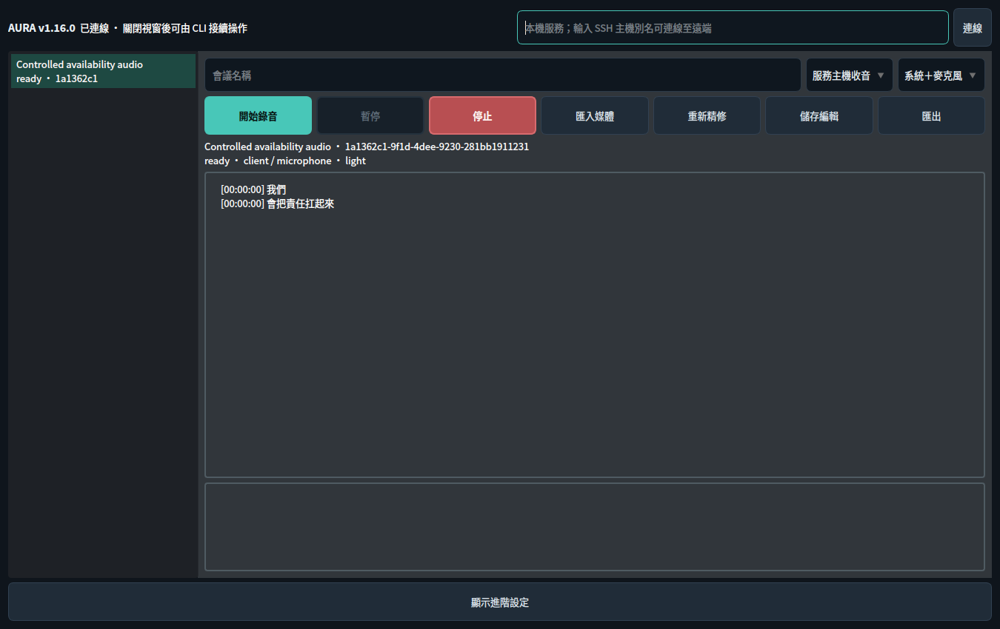

# Project AURA: Local Desktop Audio Assistant

<p>
  
  
  
  
  
  
</p>

*Repository indicators summarize maintenance, CI, runtime, ASR, UI, and license status.*

<!--
README FORMAT CONTRACT

Keep the rendered sections in this exact order:
1. Product Purpose
2. Project Status
3. Latest Update
4. Core Capabilities
5. Architecture and Ownership
6. Evidence-First Session Contract
7. Desktop Workflow
8. Installation
9. Configuration Defaults
10. Feature Behavior
11. Session Artifacts and Data Layout
12. Validation and Evidence
13. Development and Testing
14. Windows Runtime Path
15. Release and Versioning
16. Troubleshooting
17. Documentation Map
18. Repository Data Stewardship
19. License

Keep all rendered README copy in English. Place an explanatory caption
immediately after every screenshot, diagram, or illustration. Preserve
operational depth while routing dated history to GitHub Releases, design
detail to docs/, and measured runtime packets to artifacts/.

Preserve the Refactor Version, Latest Published Tag, Next Release Candidate
rows and the Latest Update heading because scripts/bump_version.py updates
them during release preparation.
-->

Project AURA is a local desktop audio assistant for professional meetings,
lectures, and transcription workflows. It brings durable recording,
RTX/CUDA speech recognition, Traditional Chinese punctuation, a plain text
editor, and local export into one recoverable workflow.


*Figure 1. Historical v1.14.0 workspace layout shows capture, waveform, and output placement; the current transcript area is a plain text editor.*

## Product Purpose

AURA turns live audio and imported media into an editable transcript backed by
preserved audio. The current flow is capture → Breeze ASR on RTX/CUDA →
Mandarin punctuation → plain text editing → local export. Stopping a recording
saves the live text and audio; full-recording refinement runs on explicit request.

The repository owns the desktop application, reusable audio and ASR services,
regression checks, platform packaging, and dated runtime evidence.

## Project Status

| Field | Value |
| --- | --- |
| Project Name | Project AURA / Ultimate Audio Assistant |
| Refactor Version | `1.17.0` |
| Latest Published Tag | `v1.14.0` |
| Next Release Candidate | `v1.17.0` |
| Release State | Versioned shared-service source; physical-device, SSH and quality acceptance follow the documented gates |
| Primary Platform | Ubuntu 22.04 / 24.04 desktop |
| Python Runtime | Python 3.10+ |
| ASR Model | `SoybeanMilk/faster-whisper-Breeze-ASR-25` |
| ASR Runtime | NVIDIA RTX/CUDA with `int8` compute |
| Transcript Editor | Plain text with persistent local hotword hints |
| Desktop UI | PyQt6 |
| Project Lead | Jason Chia-Sheng Lin, National Yang Ming Chiao Tung University |
| License | MIT |

### Release lineage

| Release | Contribution |
| --- | --- |
| `v1.17.0` candidate | Searchable session history, workspace resume, capture unpause, and client/service diagnostics |
| `v1.16.0` source checkpoint | Shared GUI/CLI/SSH sessions, explicit refinement, Light profile, uv setup, and synchronized interface versions |
| `v1.15.0` source checkpoint | Durable sessions, crash recovery, plain text editing, and local evidence search |
| `v1.14.0` | Operator-focused workspace, content-free local audit events, runtime diagnostics, integrity checks, and synchronized version automation |
| `v1.13.0` | Windows onboarding, portable packaging, RTX diagnostics, output policy, scheduling, and broader artifact visibility |
| `v1.12.0` | Structured transcript artifacts, progress telemetry, audio-quality controls, and modular transcription services |

GitHub Releases owns the durable release chronology. The sections below
describe the current product contract and link each capability to its
canonical design or evidence source.

## Latest Update — v1.17.0 (2026-09-08)

AURA v1.17.0 adds searchable session history and diagnostics to the shared
desktop and terminal service. Reopen a workspace with `aura resume --all`,
`aura resume --last`, or `aura resume SESSION_ID`.
The GUI banner, window title, footer, CLI startup banner and `aura --version`
read the same runtime metadata; the package and lockfile carry that version.

- GUI and CLI start recording directly. CLI `resume` reopens a workspace;
  `unpause` restarts paused capture. `inspect` shows saved failures and artifacts,
  and `doctor` identifies the running service version and diagnostic locations.
- The terminal adds an original pixel owl, a scrolling transcript, live audio and
  queue graphs, and progress indicators based on available work totals.
- SSH supports service-host capture and forwarding audio from the connecting computer.
- Light denoise is the requested default; Off and far-speaker remain selectable.
- Explicit refinement exports a separate result while preserving editor text.
- uv manages setup, test and build environments through the checked-in lockfile.
- Public-audio availability receipts establish the exercised CUDA path; physical
  devices, second-host SSH and reviewed preprocessing quality retain separate gates.

[Setup, SSH, architecture and validation](docs/shared-sessions-2026-09-08.md)
provide the operator route. The [September 7 checkpoint](docs/transcription-front-end-2026-09-07.md)
preserves the earlier transcription work and decisions.

## Core Capabilities

| Capability | Current operating scope |
| --- | --- |
| Live recording | Captures system audio, microphone audio, or a balanced mixed stream through PulseAudio/PipeWire sources |
| Durable capture | Writes append-only PCM journals and atomic session state for recovery and final audio reconstruction |
| Scheduled recording | Persists a timezone-aware start and stop time for service-host capture |
| Media import | Processes common FFmpeg audio and video containers through the shared serial queue |
| GPU-only ASR | Runs Breeze ASR 25 by default; optional Parakeet v2 adds English ASR on a Linux CUDA server |
| Traditional Chinese punctuation | Restores punctuation during ASR, with protected terms and a visible rule fallback |
| Hotwords | Saves a local editable vocabulary list and imports UTF-8 text; combined prompt and hotwords are validated before ASR |
| Transcript editor | Supports ordinary text editing and export with concurrent-edit protection during refinement |
| Speaker diarization | Adds optional imported-file speaker labels through `pyannote.audio` |
| Evidence search | Rebuilds a local SQLite FTS5 index for meetings, segments, and confirmed actions |
| Audio preparation | Provides FFmpeg normalization, bounded denoise presets, level protection, and progress telemetry |
| Meeting-distance modes | Offers `off`, `normal`, `far-speaker`, and `rescue-offline` policies with explicit activation paths |
| Track Splitter | Finds natural pause points around a target duration and exports ordered media chunks |
| Runtime Diagnostics | Reports GPU, CUDA, ASR model, FFmpeg, audio device, disk capacity, and output-path readiness |
| Service capability check | Reports available profiles, FFmpeg, and optional enhancement runners |
| Local audit trail | Records content-free app and workflow events with redaction, retention, owner permissions, and hash-chain integrity |
| Windows onboarding | Provides check/start wrappers, diagnostic reports, hosted CI, RTX smoke scripts, and portable release packaging |

## Architecture and Ownership

The codebase keeps testable product logic outside Qt widgets and gives each
runtime concern one clear owner.

```text
project_aura/
├── pyproject.toml                  # package and dependency contract
├── Makefile                       # setup, check, build, and version commands
├── Start-AURA.* / Check-AURA.*    # Windows onboarding entry points
├── config/
│   └── domain_glossary.yaml        # conservative ASR correction terms
├── src/
│   ├── aura/
│   │   ├── asr/                    # transcription and punctuation services
│   │   ├── audio/                  # capture, denoise, export, and splitting
│   │   ├── diarization/            # optional speaker labeling
│   │   ├── system/                 # CUDA, paths, diagnostics, and updates
│   │   ├── ui/                     # PyQt6 widgets and interaction wiring
│   │   ├── audit.py                # content-free local audit events
│   │   ├── evidence_search.py      # rebuildable SQLite FTS5 index
│   │   ├── review.py               # transcript review and revision state
│   │   └── scheduling.py           # wall-clock scheduling rules
│   └── asr_postprocess/            # glossary correction package
├── scripts/                        # diagnostics, evaluation, and release tools
├── tests/                          # standard-library regression suite
├── docs/                           # design, setup, strategy, and roadmaps
├── artifacts/                      # measured public runtime evidence
└── img/                            # semantic product screenshots
```

*Figure 4. Module ownership keeps audio, ASR, UI, and evidence services independently testable.*

### Module ownership

- `src/aura/session_core.py` owns shared sessions, persisted preferences, and the job queue.
- `src/aura/sdk.py` provides the common GUI, CLI, and SSH API.
- `src/aura/session_runtime.py` owns the single CUDA inference subprocess.
- `src/aura/settings.py` retains inspectable defaults for existing utilities.
- `src/aura/asr/` owns file and live transcription behavior.
- `src/aura/audio/` owns source discovery, capture, mixing, denoise, export,
  recording durability, and media splitting.
- `src/aura/diarization/` owns speaker-model activation and timestamp overlap
  assignment.
- `src/aura/review.py` preserves segment serialization and historical review
  compatibility for local retrieval.
- `src/aura/evidence_search.py` owns rebuildable cross-meeting retrieval.
- `src/aura/system/` owns platform facts and readiness checks shared by the UI
  and command-line diagnostics.
- `src/aura/ui/` owns presentation, signals, and operator interaction.

The architecture rule is simple: behavior that can be verified independently
from Qt belongs in a service module with a focused regression check.

## Evidence-First Session Contract

### One meeting identity

Every recording or import receives one `meeting_id`. The corresponding
`session.json` acts as the artifact locator for audio, transcript segments,
and exported files. Each downstream stage reuses
the same identity.

### Durable audio source

The capture loop appends PCM frames to `.capture/` journals for the mixed
stream and each active source. Final WAV files are reconstructed from these
journals. Delivery formats such as M4A and MP3 are produced from the preserved
audio source, while the mixed WAV anchors the final full-recording transcription.

### Transcript states and revisions

Live recognition provides provisional text. The durable audio pass creates final
machine segments for local retrieval. The editor supports free-form corrections;
export preserves its text, including whitespace. A trailing newline is added when
needed. Per-line confirmation and claim-review screens have been removed.

### Historical session compatibility

Historical summaries and review events remain readable in local session custody.
New sessions produce transcript artifacts. Summary generation and claim-review
implementation have been retired from the application.

### Rebuildable local retrieval

Canonical session artifacts remain the source of truth. `aura-evidence rebuild`
creates an atomic SQLite FTS5 derivative for fast local search. Query commands
open the index in read-only mode, and index replacement begins after schema and
version validation.

The current tool surface focuses on review and retrieval:

- meeting search;
- segment search;
- audio-span lookup;
- confirmed action retrieval from historical sessions.

External action connectors form a separately activated work package after a
real consumer, repeated operational demand, item-level approval, and audit
evidence establish the value.

## Desktop Workflow

### Transcription workspace

1. Run `aura gui` or `project-aura`. The shared service starts locally.
2. Select a session or choose microphone, system audio, or both for a new recording.
3. Open advanced settings for the audio profile, language, hotwords, scheduling,
   speaker labels, and shared GUI/CLI defaults.
4. Start recording or import media directly.
5. Edit and save transcript text. Pause holds capture and queued recognition;
   the current inference completes safely.
6. Stop to save accepted audio and text. Select Refine for an explicit second pass.
7. Export text, JSON, or WAV. Attach from `aura` to control the same session.

### Settings and Runtime Diagnostics



*Figure 2. The v1.16.0 desktop banner identifies the source version while displaying a persisted public-audio session through the shared SDK.*

Advanced settings exposes a service capability check and shared defaults. The
connection field accepts an SSH host alias; the capture-location selector
chooses the service host or this computer. The runtime log displays service
errors and command results. Full platform diagnostics remain available through
the repository diagnostic scripts.

For slash commands, server installation, SSH forwarding, recovery, and the
validation scope, see [Shared sessions](docs/shared-sessions-2026-09-08.md).

### Track Splitter


*Figure 3. Track Splitter presents the complete source-to-output sequence and keeps duration targets, tolerance, progress, and processing details visible during long media jobs.*

The Track Splitter workflow:

1. Select an audio or video source.
2. Select the output directory.
3. Set the target segment length and tolerance.
4. Start processing.
5. Review ordered chunks created near natural pauses.

## Installation

### Recommended Linux runtime

- Ubuntu 22.04 or 24.04 desktop
- Python 3.10 or newer
- NVIDIA RTX GPU with an activated CUDA runtime
- PulseAudio or PipeWire with PulseAudio compatibility
- FFmpeg, PortAudio development headers, and Python development headers
- `uv` for the repository Make targets

Install system packages:

```bash
sudo apt-get update
sudo apt-get install -y ffmpeg portaudio19-dev python3-dev
```

### Standard application environment

The standard profile includes the application and the model-backed
Traditional Chinese punctuation path:

```bash
make setup-app
uv run --no-sync aura gui
```

`pyproject.toml` and `uv.lock` form the dependency contract for local setup,
CI, and release builds.

### Direct uv setup

```bash
uv sync --locked --extra cli --extra gui --extra capture --extra server --extra punctuation
uv run --no-sync aura gui
```

The package exposes three entry points:

- `aura`: interactive terminal; `aura gui`: desktop
- `project-aura`: desktop
- `aura-evidence`

### Complete development environment

```bash
make setup-dev
```

This profile installs every declared optional dependency group for development,
testing, evaluation, diarization, punctuation, and model research.

### Transcription-only setup

The transcription application requires no LLM service. Existing Ollama
installations and user model files are left under their owner's control.

### Speaker diarization

```bash
uv sync --locked --extra cli --extra gui --extra capture --extra server --extra punctuation --extra diarization
export HUGGINGFACE_TOKEN=hf_your_token_here
```

Accept the Hugging Face terms for
`pyannote/speaker-diarization-community-1`, then provide
`HUGGINGFACE_TOKEN`, `HF_TOKEN`, or an `AURA_HF_TOKEN_FILE` path through the
local secret environment.

## Configuration Defaults

| Setting | Default |
| --- | --- |
| Sample rate | `16000 Hz` |
| Audio frame | `30 ms` / `480 samples` |
| Live VAD | Stateful bundled Silero v6; WebRTC level `3` fallback |
| ASR model | `SoybeanMilk/faster-whisper-Breeze-ASR-25` |
| ASR device | `cuda` |
| ASR compute type | `int8` |
| ASR beam size | `5` |
| Language | `zh` |
| Target volume | `-20 dBFS` |
| Live capture source | System audio and microphone |
| Live maximum segment | `12.0 seconds` |
| Live energy gate | `1000.0 RMS` |
| Recording delivery format | `M4A / AAC-LC 96k` |
| Meeting distance mode | `normal` through the Light profile |
| Denoise preset | `light` |
| Speaker diarization | Operator-activated; imported media; `2-6` speakers |
| Traditional Chinese punctuation | Active |
| Splitter target | `40 minutes` |
| Splitter tolerance | `5 minutes` |

### Runtime environment variables

| Variable | Purpose |
| --- | --- |
| `AURA_RUNTIME_DIR` | Location for transient normalized WAV files and live transcript backup |
| `AURA_AUDIT_DIR` | Local audit-event directory |
| `AURA_AUDIT_ENABLED` | Audit-event activation control |
| `AURA_AUDIT_RETENTION_DAYS` | Local audit retention period; default `90` days |
| `HUGGINGFACE_TOKEN` / `HF_TOKEN` | Speaker-diarization model access |
| `AURA_HF_TOKEN_FILE` | Local file path that supplies the diarization token |
| `AURA_CLEARVOICE_PYTHON` | Python runtime for the separately activated ClearVoice evaluation path |

The default transient runtime directory is:

```text
/tmp/project_aura/
```

Set a dedicated path when the runtime needs a different temporary storage
location:

```bash
export AURA_RUNTIME_DIR=/path/to/runtime
```

## Feature Behavior

### GPU-only ASR

AURA ASR runs on the CUDA execution contract. The settings layer, model loader,
file pipeline, live queue, runtime report, and smoke scripts share the same
device requirement. Runtime activation stops at a clear product-facing gate
when CUDA libraries or the ASR model require attention.

The file-transcription prompt guides the recognizer toward a professional
Traditional Chinese meeting record with full-width punctuation that follows
the speaker's tone. The Settings panel provides an editable prompt for each
workflow.

### Optional English ASR: Parakeet v2

**Local addition (unreleased):** select `parakeet-tdt-0.6b-v2` for English
file imports, live VAD segments, and explicit recording refinement. Breeze
remains the default for Chinese and mixed-language work. Windows clients can
connect to the Linux inference server through the existing SSH workflow.

Install the optional runtime on a Linux Python 3.12 server, then download the
pinned checkpoint explicitly:

```bash
uv sync --locked --extra cli --extra server --extra parakeet --inexact
uv run --no-sync aura models download parakeet-tdt-0.6b-v2
uv run --no-sync aura transcribe english.wav --model parakeet-tdt-0.6b-v2
uv run --no-sync aura record --model parakeet-tdt-0.6b-v2 --source microphone
```

After updating, finish active work and restart the service so it loads the new
code. In the GUI, choose **Parakeet v2** in the ASR model selector.
The shared-defaults button applies the selection to future GUI and CLI sessions.
Existing sessions retain their own model, including during refinement; legacy
sessions use Breeze. `aura doctor` reports the available model capabilities,
optional dependencies, and cached checkpoint without loading weights onto CUDA.

In the interactive `aura>` workspace, use:

```text
/model                              # Show selected model and actual load state
/model parakeet-tdt-0.6b-v2          # Select English Parakeet and preload it
/model breeze                       # Select Breeze and preload it
/model load                         # Preload the saved default
/model unload                       # Release the ASR worker and GPU memory
```

Press **Tab** to complete commands, options, model names, and local file paths:
`/mo` completes to `/model`, `/model para` completes the Parakeet model name,
and `/record --mo` completes to `/record --model`. When several choices match,
Tab fills their shared prefix; press Tab again to cycle the choices. Press
**Enter** to execute the completed command. Reopen the CLI after updating to
use the new completion behavior.

Model commands are listed in `/help` and completion. Startup reports the ASR load
state; entering the CLI alone leaves inference unloaded. `/record` and `/transcribe`
load their selected model automatically. Explicit preloading runs in the background
and reports `loading`, `loaded`, or an error. A successful selection becomes the
shared default for new sessions; existing sessions keep their own model. Finish
active work before switching or unloading. A failed load keeps the previous default.
For shell scripts, use `aura model ...` and poll `aura --json model status` until
`state` is `loaded` or `error` before continuing.

Explicitly preloaded models stay resident across idle periods and CLI disconnects
until `/model unload`, a different-model job, or service shutdown. This lets an
operator choose when to hold GPU resources. The [CLI model-control receipt](artifacts/asr-parakeet-availability/README.md#cli-model-controls)
records actual preload, reuse through transcription, and worker exit after unload.

Parakeet supplies English punctuation and segment timestamps. Its selection
sets English and disables Whisper prompts, hotwords, beam-size controls, and
Chinese punctuation restoration. Breeze vocabulary and prompt preferences are
retained. Explicit incompatible options receive an error. Speech-input scratch
files use 16 kHz mono PCM; source recordings and delivery audio keep their existing
formats. NeMo scores are not reported as Whisper log probabilities.

One subprocess owns ASR. Jobs for the same model reuse it while the worker is
active; switching models closes the old subprocess before loading the next.
Idle workspaces release automatically loaded workers; explicit preloads remain
until released as described above. Parakeet uses NeMo 3.0.0, CUDA FP32,
batch size 1, local attention `[128, 128]`, and automatic subsampling chunking.
Live output uses AURA's existing VAD segments; native streaming, hotword boosting,
quantization, and Windows-native NeMo remain separate work packages.

The [public-audio availability packet](artifacts/asr-parakeet-availability/README.md#initial-availability)
records three real CUDA inferences across import, live segmentation, and
refinement, with persisted transcripts and exports. This is functional
availability evidence; accuracy, latency, throughput, long-recording acceptance,
physical microphone acceptance, and cross-model ranking remain unevaluated.
The [NVIDIA checkpoint](https://huggingface.co/nvidia/parakeet-tdt-0.6b-v2),
revision `ae9ad07059c7c739ffaf932226a8fe64ae2620b0`, is attributed to NVIDIA
under [CC BY 4.0](https://creativecommons.org/licenses/by/4.0/).

The [ASR inference decision](docs/asr-inference-decision-2026-09-09.md) explains
FP32 memory use, PyTorch/ONNX alternatives, CLI startup, and the next optimization
gate. Framework and precision comparisons remain deferred.

### Live capture and audio preservation

- Capture source choices include system audio, microphone, and a mixed stream.
- PulseAudio/PipeWire discovery resolves the default sink monitor and
  microphone source.
- Active-source RMS balancing applies bounded gain and mix headroom.
- The live queue retains source timestamps and reports processing and queue time.
  Denoising and segment gain run in the ASR worker so capture can keep journaling.
- The inactivity safeguard closes a live recording after 20 continuous minutes
  of speech inactivity and trims the trailing inactive frames.
- Recorded delivery audio uses M4A/AAC by default, with MP3 as an available
  compatibility format.

### Traditional Chinese punctuation and hotwords

The CPU punctuation model `p208p2002/zh-wiki-punctuation-restore` loads with ASR
and retries when the model is reloaded. Its tokenizer uses overlapping windows
for long passages; existing punctuation no longer skips restoration. Offset-based
insertion protects identifiers, URLs, decimals, and mixed English terms. A content
check rejects any model result that rewrites words. Model failure uses a visible
rule fallback while transcription stays available.

Hotwords are recognizer hints, shared by live, file, and final transcription.
The recording keeps the vocabulary snapshot used when it started. Automatic fuzzy
replacement on save is disabled. The standalone glossary research helper remains
available only through explicit opt-in.

### Speaker diarization

Speaker diarization is an imported-media capability. The pipeline:

1. prepares the source audio;
2. runs Breeze ASR;
3. runs `pyannote/speaker-diarization-community-1`;
4. maps each transcript segment to the speaker turn with the greatest timestamp
   overlap;
5. emits labels such as `SPEAKER_00` and `SPEAKER_01`;
6. writes speaker labels into the editable transcript.

Equal minimum and maximum speaker counts activate an exact speaker count.
Different values activate the configured speaker range.

### Summary retirement

New transcripts contain no generated summary. Dedicated LLM code, prompts,
dependencies, UI controls, and summary evaluation runners have been removed.
Historical reports remain dated evidence of the former implementation.

### Denoise and meeting-distance modes

The shared audio profiles combine denoise and meeting-distance settings. Light
is the requested default, with Off retained for direct input. The underlying
meeting-distance policies are:

- `off`: direct capture and preparation;
- `normal`: lightweight meeting-room preparation;
- `far-speaker`: stronger VAD bridging, bounded segment gain, and the medium
  preparation floor;
- `rescue-offline`: an imported-media evaluation path for ClearVoice or
  ClearerVoice.

The built-in denoise presets are `off`, `light`, and `medium`. Short buffers use
adaptive FFT and hop sizes. Silent buffers remain intact. DeepFilterNet3 and
ClearVoice stay in separate environments so the primary NumPy 2 application
contract remains stable.

Light is a user-selected operating default. Promotion of a different backend
begins with a fixed, acoustically reviewed far-field
corpus and measured transcript quality. See
[`docs/denoise_upgrade_plan.md`](docs/denoise_upgrade_plan.md).

### Runtime diagnostics and local audit

The runtime report centralizes platform facts for command-line tools, ASR
activation guidance, and the desktop UI. The local audit system records
content-free lifecycle, UI, model, recording, import, splitter, and
diagnostic events.

Audit stewardship includes:

- transcript, summary, audio, prompt, credential, and path redaction;
- stable lowercase event identifiers;
- per-session sequence numbers;
- SHA-256 hash-chain integrity;
- owner-focused local permissions;
- configurable retention;
- Markdown and JSON analysis reports;
- workflow completion, latency, repeated-action, and anomaly review signals.

Canonical design:
[`docs/audit-event-system-design.md`](docs/audit-event-system-design.md).

### Track Splitter

Track Splitter decodes the source through FFmpeg/pydub, locates silence near
the configured target duration, exports ordered chunks, and reports progress.
MP3 exports reuse the source bitrate when the media metadata provides it.

## Session Artifacts and Data Layout

### Output location policy

The shared service stores sessions under `AURA_DATA_DIR` (default
`~/.local/share/project-aura`). Export copies artifacts to a selected local
destination, including downloads from an SSH host. Each session UUID owns its
journal, text revisions, and artifact locators.

### Canonical session package

`session.json` preserves the meeting identity and source audio locators.
`live.txt`, `transcript.txt`, and explicit `refined.txt` preserve live, edited,
and refined output. `prepared_transcript.json` and `segments.json` retain the
local evidence-search contract. Raw PCM journals preserve selected source tracks;
WAV is the source artifact and M4A is the default delivery format.

The [shared-session data layout](docs/shared-sessions-2026-09-08.md#data-and-recovery)
documents service state, uploads, private connection credentials, capture recovery
spools, and unsent editor drafts. Historical session packages remain readable by
the evidence tools.

### Evidence search commands

```bash
aura-evidence rebuild outputs/transcripts outputs/aura-evidence.sqlite3
aura-evidence search-meetings outputs/aura-evidence.sqlite3 "acceptance"
aura-evidence search-segments outputs/aura-evidence.sqlite3 "organization name"
aura-evidence confirmed-actions outputs/aura-evidence.sqlite3
```

The rebuild command writes an atomic derivative from canonical session
artifacts. Meeting, segment, and confirmed-action queries use read-only index
connections.

## Validation and Evidence

### Current evidence summary

The [2026-09-08 shared-service packet](artifacts/shared-session-availability-2026-09-08/)
records two successful public-audio CUDA availability checks, with shared
controls and WAV/M4A export. Quality and latency are `not_evaluated`; the paired
denoise/VAD study awaits acoustic reference review. See the
[implementation and validation scope](docs/shared-sessions-2026-09-08.md).

| Evidence layer | Result |
| --- | --- |
| Regression suite | See the current September 7 validation receipt linked below |
| AURA ASR live minimum | 10 real CUDA/int8 transcriptions over five public Common Voice 24 zh-TW clips |
| Paired ASR runtime | AURA Breeze ASR 25 and Meetily Breeze ASR 26 each classify as `valid_target_runtime` |
| Historical LLM packet | Retained evidence for the retired implementation |
| CI | Ubuntu compile/unit checks and Windows hosted smoke and packaging checks |

The
[2026-08-26 Linux native readiness snapshot](artifacts/runtime-readiness/2026-08-26-092252-linux-native-preflight.md)
records the activated RTX/CUDA ASR model-load path, audio and output readiness,
and the former Ollama activation gate. Its status
is `PREFLIGHT_ONLY`; the dated live packets below retain runtime-validity
ownership.

### GPU-only ASR packet

This dated packet preserves the historical paired study. The active ASR
validation contract is availability-first: one explicitly activated real
inference confirms that the pinned system is available and produces a usable
transcript. Accuracy, latency, throughput, VRAM, and cross-model ranking remain
outside that availability check. The retired
`scripts/benchmark_aura_meetily_asr.py` entry point exits before model loading.

[`artifacts/asr-benchmark/2026-07-13-common-voice24-minimum/`](artifacts/asr-benchmark/2026-07-13-common-voice24-minimum/)
contains:

- five public Common Voice 24 zh-TW clips with reference text;
- 20 real transcriptions across the paired AURA and Meetily paths;
- request summaries and run configuration;
- event traces and error logs;
- GPU telemetry;
- latency analysis;
- runtime validity classification;
- source manifest and final decision report.

The clean-speech packet remains historical evidence for its dated execution.
Future audio preprocessing research uses a separately activated study with one
fixed ASR runtime and reviewed ground truth; it evaluates preprocessing effects,
not ASR model performance.

Audit event:
[`docs/audit-events/2026-07-14-gpu-only-asr-live-benchmark/audit-event.md`](docs/audit-events/2026-07-14-gpu-only-asr-live-benchmark/audit-event.md).

### Local Gemma 4 packet

[`artifacts/llm-runtime/2026-07-23-ollama-gemma4-e4b-qat-minimum/`](artifacts/llm-runtime/2026-07-23-ollama-gemma4-e4b-qat-minimum/)
contains:

- the exact Ollama and model configuration;
- 12 real model requests;
- a complete nine-field AURA summary run;
- request summaries and event traces;
- GPU telemetry with AURA ASR resident;
- schema and runtime validity reports;
- latency, analysis, source manifest, and final product decision.

This historical packet records the retired implementation. Current transcription
uses no LLM runtime. September 7 front-end checks are recorded in
[`artifacts/asr-front-end/2026-09-07/runtime-smoke.json`](artifacts/asr-front-end/2026-09-07/runtime-smoke.json).

## Development and Testing

### Run the complete check

```bash
make check
```

This command compiles source and tests, then runs the standard-library
regression suite.

Equivalent commands:

```bash
PYTHONPATH=src python -m unittest discover -s tests
python -m compileall src tests
```

### Focused release checks

```bash
PYTHONPATH=src python -m unittest -q \
  tests.test_versioning \
  tests.test_bump_version
```

### Coverage areas

The regression suite covers:

- file import preparation, formatting, cleanup, queueing, and cancellation;
- durable recording journals, checkpoints, recovery, and partial audio
  preservation;
- session identity and historical transcript/review artifact compatibility;
- historical confirmed-action search;
- SQLite schema validation, atomic rebuild, read-only queries, and path
  containment;
- CUDA activation, model loading, runtime diagnostics, and report formatting;
- live capture source discovery, RMS mixing, VAD, inactivity safeguards, and
  telemetry;
- M4A and MP3 export, normalization, limiter behavior, and FFmpeg progress;
- punctuation, glossary correction, correction logs, and artifact naming;
- speaker diarization timestamps and speaker-count policy;
- plain text editing, hotwords, concurrent-edit protection, and summary-free packaging;
- denoise presets, meeting-distance modes, and evaluation gates;
- scheduled recording calculations;
- Track Splitter selection, ordering, export, and progress;
- audit redaction, integrity, retention, reporting, and workflow analysis;
- Windows-hosted setup, packaging layout, and RTX smoke contracts.

### Build artifacts

```bash
make build
```

The build uses `uv build` to produce a source distribution and wheel from the
package metadata.

## Windows Runtime Path

### Portable onboarding

1. Install or update the NVIDIA driver.
2. Extract `aura-windows-portable-v<version>.zip`.
3. Run `Check-AURA.bat`.
4. Review `diagnostic_report.txt`.
5. Run `Start-AURA.bat`.

The wrappers prepare `.venv`, install dependencies, verify FFmpeg and NVIDIA
visibility, run the shared RTX/CUDA diagnostics, and launch the same PyQt6
application used by Linux.

### Developer validation

```powershell
nvidia-smi
python scripts/runtime_report.py
python scripts/windows_gpu_smoke.py
python scripts/windows_asr_artifact_smoke.py
```

The Windows path includes:

- hosted GitHub Actions for compile, unit, PyQt import, runtime report, and
  portable packaging;
- a gated self-hosted RTX lane for real model-load and ASR artifact smoke;
- root-level PowerShell and batch entry points;
- a versioned portable ZIP builder;
- platform-specific setup and activation guidance.

Detailed guides:

- [`docs/windows_setup.md`](docs/windows_setup.md)
- [`docs/windows_native_roadmap.md`](docs/windows_native_roadmap.md)
- [`docs/windows_known_issues.md`](docs/windows_known_issues.md)

## Release and Versioning

Project AURA uses semantic versioning. Package versions use
`MAJOR.MINOR.PATCH`; Git tags and GitHub Releases use `vMAJOR.MINOR.PATCH`.

Prepare a version:

```bash
make bump-version BUMP=patch RELEASE_DATE=YYYY-MM-DD
make check
make build
```

The version helper synchronizes:

- `pyproject.toml`;
- `src/aura/metadata.py`;
- `uv.lock`;
- the README `Refactor Version` row;
- the README `Next Release Candidate` row;
- the README `Latest Update` heading.

`Latest Published Tag` records the release tag that currently exists. The
candidate row records the package version preparing for its next annotated tag
and GitHub Release.

The complete release contract is documented in
[`docs/versioning.md`](docs/versioning.md).

## Troubleshooting

### GPU memory pressure

- Breeze uses `int8`; the optional Parakeet runtime uses FP32.
- Close other GPU-intensive applications before long recordings.
- Use Runtime Diagnostics to review device state and model readiness.
- The shared service closes its inference subprocess when idle and before
  switching models, releasing that process's CUDA allocations.

### CUDA activation

- Run `nvidia-smi`.
- Run `python scripts/runtime_report.py`.
- Confirm CUDA, cuBLAS, cuDNN, `ctranslate2`, and `faster-whisper` readiness.
- Refresh the desktop environment with `make setup-app` after dependency updates.

### Audio source discovery

- Confirm microphone and output devices in system settings.
- Confirm the PulseAudio/PipeWire compatibility service.
- Inspect sources with:

```bash
pactl info
pactl list short sources
```

- Runtime status and event logs record the selected source and active capture
  path.

### Punctuation activation

If punctuation falls back to rules, install the `punctuation` extra and reload
the ASR model. Reload clears the cached punctuation load failure and retries.
Keep the runtime log for the exact dependency or model-access error.

### Speaker diarization activation

- Install the `diarization` extra.
- Accept the model terms for
  `pyannote/speaker-diarization-community-1`.
- Provide `HUGGINGFACE_TOKEN`, `HF_TOKEN`, or `AURA_HF_TOKEN_FILE`.
- Run Runtime Diagnostics to confirm token and model readiness.

### Long media and output size

- Keep FFmpeg visible on `PATH`.
- Select an output location with at least 1 GiB of available capacity.
- Use Track Splitter for delivery-sized media chunks.
- Review processing metrics for normalization stages, elapsed time, and export
  paths.

## Documentation Map

| Document | Purpose |
| --- | --- |
| [`docs/architecture_decisions.md`](docs/architecture_decisions.md) | Module ownership, GPU execution, session identity, evidence, output, and platform decisions |
| [`docs/aura-llm-agent-product-strategy.md`](docs/aura-llm-agent-product-strategy.md) | Historical product strategy; summary implementation retired September 7 |
| [`docs/audit-event-system-design.md`](docs/audit-event-system-design.md) | Audit schema, privacy, integrity, retention, analysis, and operator controls |
| [`docs/asr_postprocess_fuzzy_glossary.md`](docs/asr_postprocess_fuzzy_glossary.md) | Glossary correction thresholds, artifacts, and validation path |
| [`docs/denoise_upgrade_plan.md`](docs/denoise_upgrade_plan.md) | Far-field corpus, denoise candidates, evaluation metrics, and promotion gate |
| [`docs/first-principles-aura-meetily-review.md`](docs/first-principles-aura-meetily-review.md) | Cross-repository product ownership and capability migration evidence |
| [`docs/refactor_plan.md`](docs/refactor_plan.md) | Refactor phases, module boundaries, and acceptance checks |
| [`docs/versioning.md`](docs/versioning.md) | Semantic version synchronization, checks, builds, tags, and releases |
| [`docs/windows_setup.md`](docs/windows_setup.md) | Windows environment preparation and RTX validation |
| [`docs/windows_native_roadmap.md`](docs/windows_native_roadmap.md) | Windows runtime and portable release direction |
| [`docs/windows_known_issues.md`](docs/windows_known_issues.md) | Platform activation guidance and tracked validation layers |

## Repository Data Stewardship

- Application source, tests, small stable fixtures, documentation, and public
  evidence packets belong in version control.
- Private recordings and transcripts belong in the operator-selected output
  location, `outputs/`, or a dedicated data repository.
- Canonical `*_session/` directories created inside the checkout remain
  ignored local operator data.
- `tests/fixtures/` carries small, stable samples that directly support
  regression checks.
- `artifacts/` carries public, source-described, reproducible runtime evidence.
- `.record/`, local virtual environments, build products, transient runtime
  files, and private operator data stay within their designated local storage.
- Audit events remain content-free and apply redaction, local permissions,
  retention, and integrity controls.
- Credentials remain in local environment or secret-store paths.

## License

Project AURA is available under the [MIT License](./LICENSE).

Copyright (c) 2026 Jason Chia-Sheng Lin.
