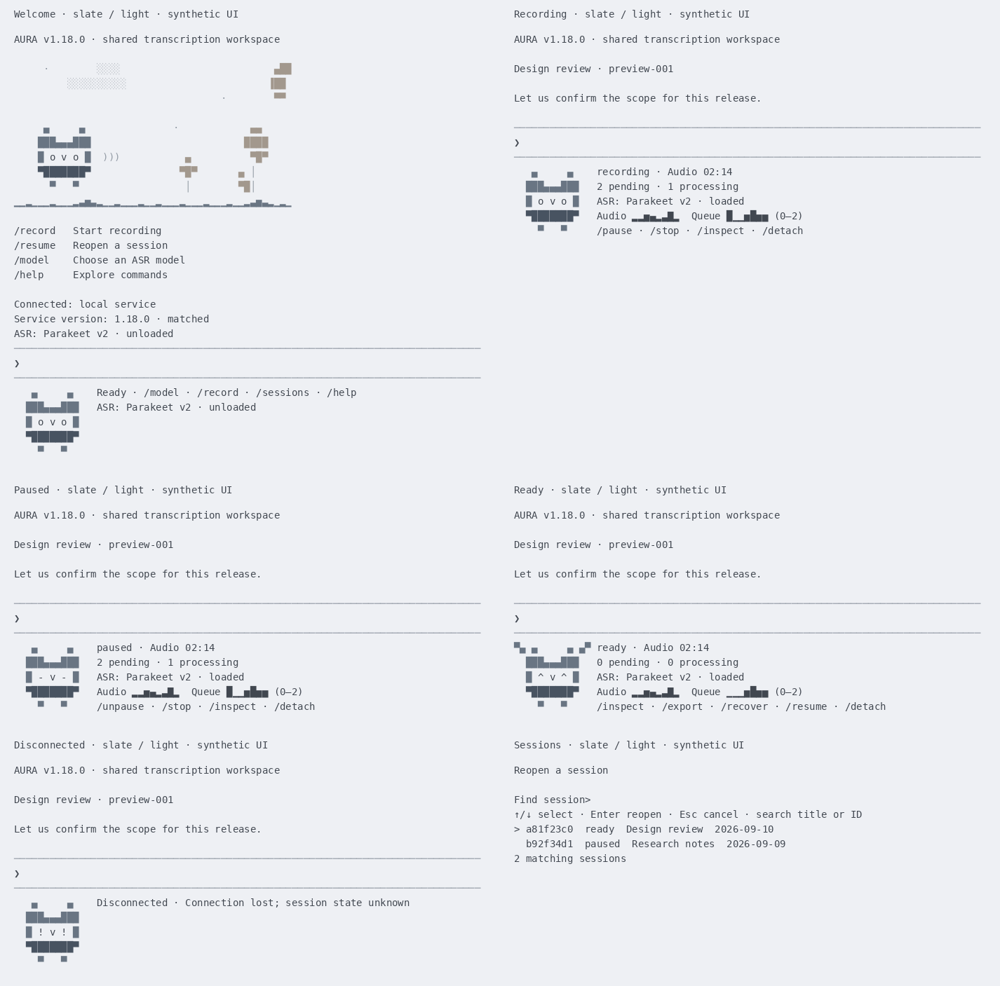
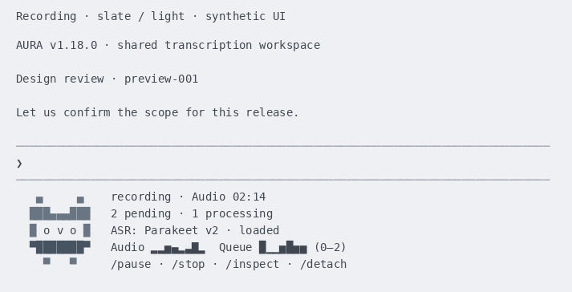

# CLI sound garden preview

Date: 2026-09-10. Scope: user-provided CLI screenshots, local presentation, and synthetic terminal validation.
The runtime version remains 1.18.0; this packet does not declare a new release.

## User-provided screenshots

The user supplied these two v1.18.0 terminal screenshots on September 10. Their
original bytes, dimensions, transparency and visible text are preserved in
`img/`. They illustrate the displayed workflow; measured inference results
remain in the dated ASR evidence packets.

| README figure | Original image | Dimensions | SHA-256 |
| --- | --- | --- | --- |
| [Fig. 1: CLI welcome](../../README.md#cli-welcome) | [Welcome screenshot](../../img/cli-welcome-v1.18.0.png) | 1621 × 1066 | `ab9d12b95bb473706f2d5e88ddb15d255df35779e81542a39db969a389f88b09` |
| [Fig. 2: recording](../../README.md#cli-recording) | [Recording screenshot](../../img/cli-recording-v1.18.0.png) | 1059 × 697 | `1fa9dbe1a2a63563f64677c13138f2737036b14bafdbba490497d86e6f9e53e9` |

README captions use sequential `Fig. N.` labels following the
[IEEE editorial convention](https://journals.ieeeauthorcenter.ieee.org/wp-content/uploads/sites/7/IEEE-Editorial-Style-Manual-for-Authors.pdf),
with the repository's italic caption immediately below each figure.
The [operator guide](../../docs/shared-sessions-2026-09-08.md#direct-recording-and-terminal-presentation)
explains the shared-session controls shown in the images.

## Synthetic palette previews


*The default slate palette shows the garden, compact ASR status and transparent toolbar across six synthetic states.*

| Palette | Light terminal | Dark terminal | Launch |
| --- | --- | --- | --- |
| Slate: layered gray, muted blue, taupe | [Preview](preview.png) | [Preview](slate-dark/preview.png) | `aura` |
| Sage: warm gray, sage accents | [Preview](sage-light/preview.png) | [Preview](sage-dark/preview.png) | `aura --palette sage` |

Both palettes color individual clouds, owl parts, flowers and the extended lawn.
Text inherits the terminal foreground and background. Explicit `noreverse`
overrides prompt toolkit's inherited toolbar and completion-selection styles.
The opening shortcuts include `/model`; persistent ASR text shows only a friendly
model name and load state. `/model` provides the full controls and load errors.


*The recording owl changes frames while the sample state stays fixed; this demonstrates motion rather than live audio capture.*

[Plain-text rendering](preview.txt) preserves the same example states. All names,
transcripts, counts and dates in the generated previews are synthetic. The garden lawn is
decorative; production audio and queue graphs read session measurements.

Regenerate in an environment with the CLI extra, Pillow and DejaVu Sans Mono:

```bash
uv run --no-sync python scripts/preview_terminal.py
uv run --no-sync python scripts/preview_terminal.py --palette slate --background dark --output artifacts/cli-garden-preview/slate-dark
uv run --no-sync python scripts/preview_terminal.py --palette sage --background light --output artifacts/cli-garden-preview/sage-light
uv run --no-sync python scripts/preview_terminal.py --palette sage --background dark --output artifacts/cli-garden-preview/sage-dark
```

The preview script contacts no service, opens no audio device and runs no ASR.
Pillow is a preview-only dependency already available in the local environment;
the CLI implementation adds no dependency. `--font PATH` selects another monospace font.
The renderer merges framework defaults with application styles, applies toolbar
ancestor classes, and resolves default foreground/background and reverse video.
The light and dark backgrounds simulate terminal themes; the CLI inherits the
user's own terminal theme.

## Validation

Validation commands:

```bash
PYTHONPATH=src uv run --no-sync python -m unittest -q tests.test_versioning tests.test_bump_version
make check
make build
uv run --no-sync python scripts/check_terminal_pty.py
uv run --no-sync python scripts/check_terminal_pty.py --palette sage
git diff --check
```

Recorded results on 2026-09-10: `make check` passed all 327 tests; the Linux
synthetic PTY check passed for both palettes. All four six-state PNGs were
visually reviewed; each GIF contains two distinct owl poses.
README integration validation on September 10 passed nine focused versioning
tests, the full 327-test suite, both palette PTY checks, and `make build` for the
1.18.0 wheel and source distribution. `git diff --check` passed. All 80 relative
links and image references across the root README, operator guide, versioning
guide and this packet resolved, including Markdown anchors. Checks confirmed
that the supplied screenshots are the first two images, all six figures have
consecutive captions, the 19-section order is preserved, and both copied PNGs
match their source SHA-256 hashes.

The PTY check uses an isolated synthetic service and audio/ASR fixtures. It
exercises one-time welcome, compact ASR status, animation toggles, resizing during partial input,
Tab without execution, picker navigation/cancellation, restored transcripts,
visible errors, model controls, and recording preservation across detach/exit.
This establishes terminal interaction behavior; real-device and ASR-quality
acceptance remain separate validation layers.
